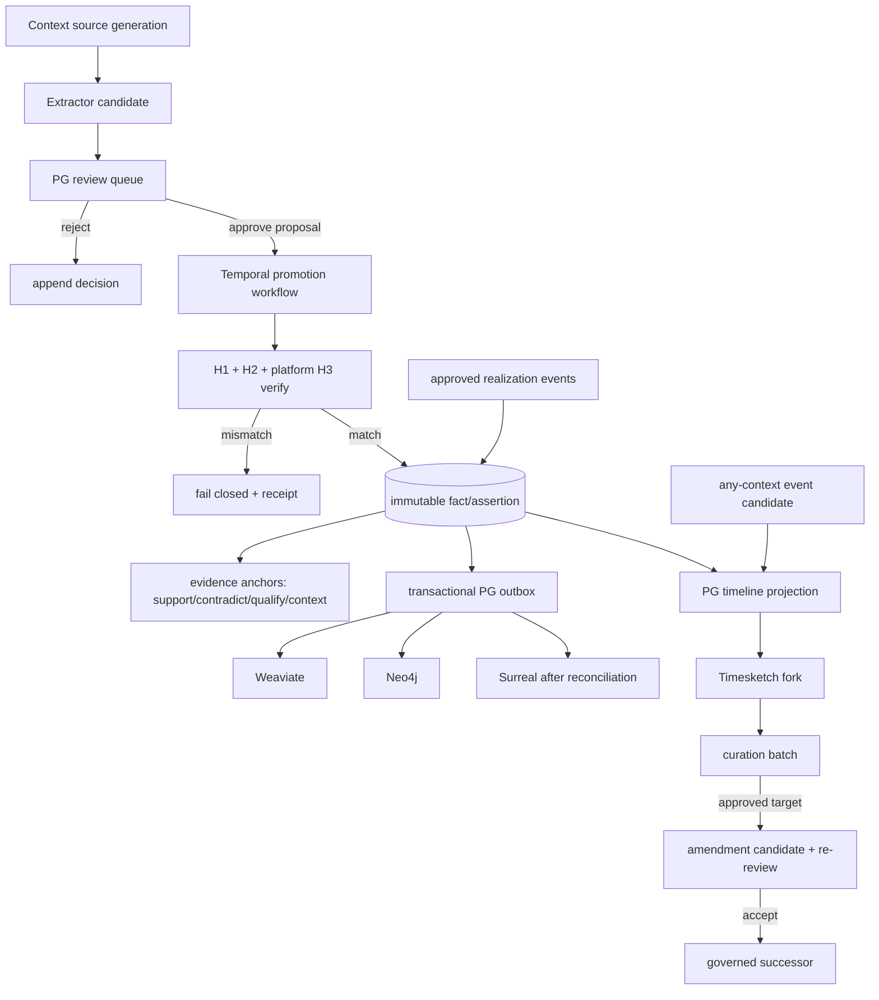

# R07 — Governed Facts, Evidence Anchors and Realizations

> Executable lane guide · 2026-08-25 schema reconciliation
>
> Governing rulings: D-069 context-first promotion; D-072 one owner/one personal
> case; D-074 extraction remains candidate-only; D-075/D-076 promotion hash
> verification; D-077/D-078 durable orchestration and PG receipts; D-080 PG authority;
> D-082–D-085 AI-chat authority, typed extraction and governed timeline curation; ADR-0060.

## Purpose and authority

Create the single PG-governed path from extracted claim candidate to immutable
established assertion/fact, with many-to-many exact evidence anchors and separate
realization events. PostgreSQL 18 is the authority for candidates, review, promotion,
evidence/custody linkage, assertions, realizations, supersession and downstream events.

Everything first lands as context (D-069). Semantica or another extractor proposes;
only the owner/governed review establishes. Realization describes when the owner learned
or recognized something; it neither changes occurrence nor backdates source availability.
AI chat is a permanent exception to general source promotion: it may originate candidates and
investigation leads, but it can never become evidence or contribute support/corroboration weight.

## Scope

In scope:

- Claim/entity/event candidates and review decisions.
- Immutable established assertions/facts and their lifecycle relationships.
- Exact source anchors and support/contradict/qualify/context classifications.
- Context-to-evidence promotion and D-075/D-076 verification records.
- Zero-to-many approved realization links and horizon derivation inputs.
- Transactional PG outbox events and receipts for downstream projections.
- Event candidates from any context source and the governed timeline projection contract.
- Versioned Timesketch curation batches, amendment candidates against approved entries, re-review,
  reconciliation and governed-successor linkage.

Out of scope:

- Extraction implementation details beyond its contract.
- Weaviate ranking, Neo4j graph schema, Surreal materialization.
- Treating a chunk, candidate, belief or search hit as truth.
- Multi-user/multi-Matter abstractions prohibited by D-072.
- Rewriting prior facts or realizations in place.
- Treating a Timesketch/OpenSearch edit, annotation or analyzer output as canonical authority.
- Materializing created works or proposed strategies as legal products; R12 owns drafts/work items.

## Owned surfaces

- Canonical PG candidate/review/promotion/assertion/evidence-anchor/realization families.
- Views deriving current assertion state and horizon eligibility.
- Promotion and assertion outbox events.
- Promotion, reverification and downstream projection receipt linkage.
- Canonical timeline candidate/collection/projection references needed to preserve fact authority,
  curation amendment and supersession relationships.

R07 does not own raw/context message schemas; D-071 sender/recipients/participants remain
verbatim on each message record and entity resolution is additive.

## Contracts

### Upstream

- Context source generation with immutable ID, content fingerprint and exact locator.
- Candidate with extractor/run/config identity, deterministic candidate hash, source
  generation and exact span/structured locator.
- Owner review command containing candidate ID, decision, rationale and reviewer actor.
- Promotion command containing original-file reference and expected normalized generation.
- Typed extraction fan-out in which claim/event candidates retain exact context source/message/span
  lineage; AI-chat lineage is explicitly `context_only` and ineligible as an evidence anchor.
- `timeline_curation_batch` with actor, rationale, idempotency key, expected projection generation,
  per-item target/version, before/after hashes, typed operation and requested strict/partial mode.

Created-work versions, strategy candidates, investigation concerns/evidence needs and observation
candidates remain typed siblings, not aliases for facts. R07 accepts claim/event review candidates;
selected created works and strategies cross to R12 only as draft/work-item commands.

### Timeline curation and approved-entry amendment

The Timesketch fork may display both context/candidate events and evidence-approved governed entries.
All fork-originated changes return through authenticated PG commands; the fork never writes canonical
relations directly. Context/candidate edits append typed annotations, resolution/grouping assertions,
review decisions or successor derived-context versions.

An edit targeting an evidence-approved entry creates a `timeline_amendment_candidate` linked to the
exact approved timeline member, fact/assertion version, evidence anchors/citations, source projection
generation and curation batch. The approved entry stays active and byte-for-byte/version-identical.
The amendment re-enters independent review and whole-entry reconciliation; rejection changes nothing,
while acceptance appends a governed successor and its outbox event. Only that successor can appear in
a later projection generation. Undo is a compensating batch, never deletion or rollback-in-place.

### Promotion verification

D-075:

1. Normalization computes provisional `h2-canonical-v2` per normalized message/record.
2. Promotion re-reads original bytes, recomputes/verifies H1 lineage and recomputes or
   verifies every selected H2; accepted custody H2 is recorded.
3. Later evidence reverification appends a new verification observation; it does not
   overwrite the promotion result.

D-076 platform evidence H3:

- `chain_0 = H1`;
- fold every ordered `h2-canonical-v2` from the full normalized source generation as
  `sha256(utf8(prev_hex || h2_hex))`;
- persist membership, order, count, H3 and tag
  `h3-chain-h1genesis-hexconcat-v1`;
- normalization may store provisional H3; promotion verifies generation membership,
  order, count and H3;
- the SBV raw empty-genesis LF chain remains a separate import receipt and must never
  share the platform-evidence tag.

### Downstream

A promoted assertion event contains canonical assertion/fact ID, review/promotion ID,
all selected evidence-anchor IDs, source generations, source-family classifications,
authority state, clocks, realization links, supersession state and canonical payload
hash. Downstream stores project this envelope; none may infer missing authority.

## PG events and receipts

Required event families:

- candidate-submitted/rejected;
- review-decided;
- promotion-requested/verified/refused;
- assertion-established/superseded/contradicted/qualified/revoked;
- realization-proposed/approved/superseded;
- source-reverified;
- projection-requested.
- timeline-projection-generated/delivered/reconciled;
- timeline-curation-submitted/item-accepted/item-rejected/item-conflict/item-no-op;
- timeline-amendment-proposed/reviewed/accepted/refused/superseded;
- timeline-curation-compensated.

The promotion transaction commits the assertion, anchors and full outbox row atomically.
Hashing activities return references and digests; raw payloads do not travel through
Temporal history (D-077). Receipts append for each hash attempt, promotion decision and
downstream event; current state is derived.

## Temporal and n8n responsibilities

Temporal durably sequences review wait, hashing activity family, PG promotion transaction,
downstream fan-out and retry. Workflow payloads are IDs/references only. Hash mismatch,
source-generation drift, partial selection or missing locator fail closed. Temporal owns
workflow identity, retry and durable history, not factual judgment.

n8n owns visual/business coordination: assemble review context, notify the owner, display
evidence/contradictions, collect rationale and signal Temporal. It cannot compute custody
hashes, mutate canonical state directly, auto-establish claims, or retry durable work.

## Invariants

1. Context precedes evidence; promotion is the only custody boundary.
2. Candidate, assertion/fact, evidence item and realization are distinct identities.
3. No fact exists without attributable review and exact source anchor(s).
4. A chunk ID alone is never sufficient provenance.
5. Supporting, contradicting, qualifying and contextual anchors are first-class and
   many-to-many.
6. Corrections append a new assertion linked by `supersedes`, `contradicts` or
   `qualifies`; no silent rewrite.
7. Realization is plural, separately approved and never substitutes for occurrence or
   `source_available_from`.
8. Derivative copies are grouped by source family before corroboration counts.
9. Promotion verifies full normalized generation H2 membership/order/count/H3.
10. SBV import H3 and platform evidence H3 remain separately tagged receipts.
11. One owner/one personal case: no speculative tenant/Matter abstraction.
12. AI chat is never evidence, never an anchor and never corroboration; exact chat lineage remains
    visible only as context/extraction provenance with zero support weight.
13. Event candidates may originate from any context source and may coexist with governed entries in
    the fork only when authority is explicit and filterable.
14. Every fork edit is a versioned attributable PG curation batch; stale versions and prohibited
    authority transitions fail closed, and partial bulk results are itemized.
15. An approved timeline/fact version is immutable. Any proposed change becomes an amendment candidate
    and requires independent re-review/reconciliation before a governed successor is appended.
16. Created works and strategies never become facts through this lane; they hand off to R12 only as
    drafts/work items with their context-only lineage intact.

## Evidence-backed current gaps

Evidence labels: **source-proven** means tracked code/configuration; **dated live snapshot**
means observed read-only on 2026-08-26 but not mutation/execution/security proof;
**production-reported** means an older dated handoff; **stale** conflicts with newer evidence;
and **unverified** was outside the snapshot or still requires R14 attestation.

- **Critical · source-proven:** Semantica is locally candidate-only
  (`server/analysis/semantica_worker.py:1-8,120-159`) and its deployment wiring remains
  approval-gated/fixture-only (`server/analysis/semantica_wiring.py:133-160`). No tracked
  production runner, candidate-to-governed-fact transition, Neo4j evidence projector or
  universal projection receipt completes the ruled lifecycle.
- **Source-proven:** code writes
  `working.candidate_entity|candidate_fact|candidate_event`
  (`server/analysis/semantica_candidates.py:217-321,324-333`); ADR-0052/0057 rules
  `entity_candidate` and append-only `claim_candidate` semantics.
- **Production-reported, not refreshed:** `analysis.knowledge_evidence_promotion` had insertion guards,
  but the Aug-24 audit found no transition that flips evidence status, no Semantica
  bridge, and empty target analysis/promotion tables
  (`docs/research/integration-audit-2026-08-24/lane-4-analysis-promotion.md`). The 2026-08-26
  read-only snapshot did not query those relations, so the row counts remain dated evidence.
- **Source-proven:** existing promotion DDL/runtime still begins from evidence-linked
  normalized rows and verifies only ingest-time H1, not the full D-075/D-076 normalized
  H2 membership/order/count and platform H3 lifecycle
  (`server/case_management/repository.py:643-713,793-895`,
  `sql/0030_matter_case_foundation.sql:265-332`).
- **Source-proven:** exact fact-to-many-source and fact-to-chunk-generation traversal is
  design truth in ADR-0057, not an observed production flow.
- **High · source-proven plus dated live snapshot:** the pass-role migration documents all-walk
  visibility without RLS and prior superuser bypass
  (`sql/0029_pass_grants.sql:20-27,43-52,145-153`). On 2026-08-26 exec still used the
  PostgreSQL superuser `ai`, not `agno_app`, and RLS was enabled on 0 of 143 inspected
  evidence/working/analysis base tables. Exact grants and per-actor denial were not exercised
  (`../COMPLETE-CODEBASE-AUDIT.md`, read-only live-parity snapshot).
- **Critical · source-proven/deployed-product violation:** Workbench detection identifies AI-chat
  exports and `service/promote.py` sends them to `/v1/evidence/import` with
  `workflow=chat-transcript`, a custody-first route. The audited live Workbench deployment lineage
  still exposes the promote surface, and no live denial test proved it disabled. This violates D-082
  before R07 review even begins and can launder AI context toward evidence authority
  (`workbench/api/app/service/promote.py:1-15,112-143`; GAP-023).
- **High · design-only timeline governance:** no observed production schema/API/projector implements
  ADR-0060 curation batches, item-level conflict results, approved-entry amendment candidates,
  compensating reversal or successor-only reprojection. Therefore approved timeline edits cannot yet
  be safely round-tripped and re-reviewed.
- **High · incomplete typed candidate intake:** the current Semantica candidate tables do not prove
  the full D-083 fan-out or a governed any-context event-candidate path into Timesketch; created works
  and strategies lack a proven R12-only handoff.

### Applicable audit gaps

The deduplicated register assigns these blocking or mandatory findings to R07:
[`GAP-004`](../AUDIT-GAP-REGISTER.md), [`GAP-005`](../AUDIT-GAP-REGISTER.md),
[`GAP-007`](../AUDIT-GAP-REGISTER.md), [`GAP-018`](../AUDIT-GAP-REGISTER.md),
[`GAP-021`](../AUDIT-GAP-REGISTER.md), [`GAP-031`](../AUDIT-GAP-REGISTER.md),
[`GAP-033`](../AUDIT-GAP-REGISTER.md), and [`GAP-034`](../AUDIT-GAP-REGISTER.md).

## Implementation phases

### Phase 0 — Canonical terminology and identity

Freeze candidate, assertion/fact, evidence anchor, source family, realization and
promotion identities. Map legacy tables without destructive rename. Specify canonical
serialization and all state transitions.

### Phase 1 — Additive source-anchor model

Create exact locator/source-generation relations and many-to-many assertion-evidence
classifications. Backfill only when exact resolution is provable; quarantine ambiguous
rows rather than guessing.

### Phase 2 — Review and immutable fact lifecycle

Implement append-only review decisions and established assertions plus relationship
edges for correction/contradiction/qualification. Enforce grants so extractors cannot
write established state.

### Phase 3 — Promotion and hashing activities

Implement ref-only Temporal workflow and standalone H1/H2/H3 activities. Atomically
write accepted custody verification, promotion, assertion/anchors and outbox. Append
later reverification observations.

### Phase 4 — Realization integration

Retain zero-to-many approved realization links and derived horizon views. Do not stamp
horizon on normalized content.

### Phase 5 — Projection/reconciliation

Emit ordered full events, receive R09 receipts and expose a canonical readiness view.
No downstream reader activates before exact-source and manifest gates pass.

### Phase 6 — Governed timeline round trip

Project context candidates and governed entries as separate authority classes. Implement immutable
curation batches, item-level validation/conflict receipts, approved-entry amendment candidates,
independent re-review, successor-only projection and compensating reversal. Hand selected created
works/strategies to R12 as draft/work-item commands only.

## Test matrix

| Test | Proof |
|---|---|
| Candidate isolation | extractor role cannot establish/promote |
| Exact provenance | fact traverses span/generation to original/H1 |
| Multi-anchor | support and contradiction coexist without overwrite |
| Source family | derivative copies count once independently |
| Promotion H2 | every ordered record recomputed/verified |
| Platform H3 | known-answer H1-genesis hex-concat result/tag |
| Chain separation | SBV LF-chain receipt cannot satisfy evidence H3 check |
| Drift | changed generation fails closed before promotion |
| Transactionality | no assertion without outbox; no outbox without assertion |
| Realization | zero/many links; occurrence/availability unchanged |
| Supersession | old assertion immutable; current view changes |
| Replay | duplicate signal/activity is idempotent |
| Production dispatch | no fixture/manual path can bypass the governed candidate runner |
| Role denial | extractor cannot write fact/promotion and one actor cannot read another walk |
| Required integration | CI fails if candidate/promotion/realization live tests are skipped |
| AI-chat denial | direct, owner-approved, bulk and derivative-copy attempts create no evidence anchor or support weight |
| Any-context timeline | representative source families create stable candidate/context-only timeline members without authority loss |
| Mixed timeline display | candidate and governed entries coexist with unmistakable badges and governed source opening |
| Context curation round trip | accepted edit appears only after PG validation/outbox; stale item conflicts fail closed |
| Approved-entry edit | amendment candidate is linked; approved version is unchanged until successor acceptance |
| Bulk/undo | partial results are itemized; strict mode is atomic; undo appends a compensating batch |
| R12 boundary | created works/strategies can create draft/work-item handoffs but never facts/citations directly |

## Live acceptance

- A real context source is promoted through the workbench/n8n signal and Temporal
  workflow with ref-only history.
- H1, each H2, full membership/order/count and platform H3 verify against the original.
- A promoted fact resolves to its exact source span and custody record.
- A conflicting source attaches as contradiction without rewriting either assertion.
- An approved realization changes the eligible horizon view only as ruled.
- PG outbox and downstream receipts reconcile at the same event sequence.
- Hash mismatch and source drift demonstrate fail-closed behavior live.
- Runtime role/grant probes prove extractor, reviewer, projector and walk-reader
  separation using the deployed principals.
- The Timesketch fork displays one context candidate and one evidence-approved entry, then round-trips
  individual and mixed-validity bulk edits through immutable PG curation receipts.
- A proposed edit to the approved entry leaves the active version unchanged, enters re-review, and
  only an accepted reconciled successor appears in a new projection generation.
- A Workbench AI-chat promote attempt is denied before evidence import while typed candidates still
  reach the claim/investigation/timeline queues.

### Stop gates

Stop promotion or downstream event emission while any condition holds:

- a fixture/manual extractor path can bypass the governed production candidate runner;
- exact original span/generation, review actor or source-family classification is missing;
- full normalized H2 membership/order/count and platform H3 are not recomputed/verified;
- extractor/reviewer/projector grants or cross-walk isolation are not live-proven;
- hash drift, duplicate signal or realization/horizon tests are skipped or stale.
- any fork action directly mutates a fact/approved timeline version or external store, accepted edits
  appear before PG outbox reconciliation, or amendment review is bypassed;
- any AI-chat lineage becomes an evidence anchor/support source, or a created work/strategy becomes a
  fact rather than an R12 draft/work item.

## Migration and rollback

Use new numbered additive migrations. Preserve legacy relations/views while readers
migrate. Backfills write mapping/receipt records; never invent missing provenance.
Rollback disables new writers/read views and returns consumers to prior bindings while
preserving appended records. Nothing is deleted; retirement goes to `to_be_deleted`.

## Risks

- Candidate laundering into fact status.
- Retrofitting exact spans by inference.
- Promotion guard preserving pre-D-069 ordering.
- Partial-source approval exposing full content.
- Realization time collapsing to an unreviewed midpoint.
- H3 construction/tag collision.
- Projection event missing an anchor or correction relationship.
- Local candidate extraction being mistaken for a governed production fact lifecycle.
- Out-of-band grants or superuser inheritance bypassing reviewer/walk separation.

## Agent instructions

- Read D-069, D-072, D-074–D-078 and the master before editing.
- Treat applied SQL as immutable; add a migration and compatibility view.
- Never auto-promote or silently infer provenance/realization.
- Keep Temporal payloads ref-only and hashing in its separate activity family.
- Coordinate shared event/receipt changes with R09 owner.
- Run unit and live integration tests; attach observed rows/hashes, not config claims.

## Exact handoff checklist

- [ ] Canonical identity/state-transition document attached.
- [ ] Legacy-to-target mapping is explicit and non-destructive.
- [ ] Exact-anchor traversal proven for every migrated/new assertion.
- [ ] Candidate and established-fact grants tested.
- [ ] Production Semantica runner and candidate-to-fact transition traced with receipts.
- [ ] Deployed runtime roles/RLS deny extractor promotion and cross-walk reads.
- [ ] Promotion workflow/activity IDs and retry policies recorded.
- [ ] H1/H2/H3 known-answer and full-generation manifests attached.
- [ ] SBV and platform H3 receipts shown separately.
- [ ] Realization/horizon tests pass.
- [ ] Atomic outbox proof and event high-water mark attached.
- [ ] Live success plus mismatch/drift refusal attached.
- [ ] Downstream consumers and residual owners named.
- [ ] AI-chat source-class denial and zero-support-weight constraints pass live, including Workbench bulk paths.
- [ ] Any-context event candidates project with stable lineage and explicit candidate authority.
- [ ] Timesketch curation batch/item contracts, expected versions, hashes and itemized outcomes are proven.
- [ ] Approved-entry edits create amendment candidates; immutable-before/successor-after proof is attached.
- [ ] Re-review/reconciliation, strict/partial bulk behavior and compensating reversal pass live.
- [ ] Created-work and strategy branches hand off to R12 as drafts/work items only.