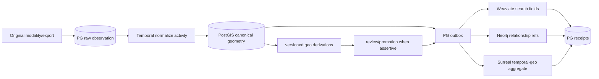

# R08 — PostGIS Geo and Modality Reconciliation

> Executable lane guide · 2026-08-25 schema reconciliation
>
> Governing rulings: D-069 context-first; D-071 verbatim message participants;
> D-072 one owner/one personal case; D-078 PG CDC/receipts; D-079 raw geo plus
> canonical PostGIS geometry; D-080 PG18 and extensions are canonical.

## Purpose and authority

Agno/AgentOS is a replaceable execution and orchestration adapter, not a truth authority. It may
invoke this lane only through platform-owned governed contracts; its sessions, memories, tool
outputs and generic database facilities cannot establish or mutate canonical state.

Make PostgreSQL/PostGIS the canonical home for raw location observations, normalized
geometry, temporal uncertainty, modality-specific source anchors and derived geo
assertions. Preserve raw provider payloads and their semantics while exposing typed,
indexed geometry for spatial reasoning. Downstream search/graph/Surreal representations
are rebuildable projections.

## Scope

In scope:

- Raw geo observations and provider/device/source identity.
- Canonical PostGIS geometry, SRID, accuracy and temporal fields.
- Modality identity and exact locators for messages, calls, media, documents, geo and
  structured records.
- Derived stay-point/route/co-location/location assertions as candidates or governed
  assertions, never silent facts.
- PG outbox, receipts and cross-store geo reconciliation.

Out of scope:

- Inventing participant/entity identity from coordinates.
- Removing sender, recipients or participants from message records.
- Search ranking, graph traversal or Surreal walk policy.
- Treating device presence as person presence without reviewed linkage.
- Multi-tenant/multi-Matter design.

## Owned surfaces

- Canonical raw-geo and normalized-geometry PG relation families.
- Geo/modality source-anchor extensions and PostGIS constraints/indexes.
- Deterministic geo normalization/derivation activities and receipts.
- Expected geo manifests and parity test fixtures.

R08 does not own message schemas. Under D-071, sender/recipients/participants remain
verbatim on first-party, acquired-third-party and AI-chat message records; entity links
are additive resolution relations.

## Contracts

### Upstream raw observation

Required fields:

- source/source-generation and provider export IDs;
- provider/device/account identifiers as observed, plus optional resolved entity refs;
- original coordinates/axis order/string representation and provider payload hash;
- provider timestamp(s), timezone/offset evidence and precision;
- altitude, horizontal/vertical accuracy, speed/bearing and provider confidence when
  supplied;
- exact locator into the original file/record and context fingerprint.

Raw values are retained even after canonicalization.

### Canonical geometry

- PostGIS geometry/geography type and explicit SRID (normally WGS84/EPSG:4326 for
  interchange, with any analysis projection documented).
- Canonical longitude/latitude order; range and validity constraints.
- Normalization algorithm/version and transformation receipt.
- Occurrence interval/precision separate from ingestion, source availability,
  realization and PG write clocks.
- No false precision: uncertainty/accuracy remains explicit.

### Downstream projection

Events carry canonical geo object/assertion ID, exact source anchor, WKB or ruled
canonical representation/hash, SRID, bbox/centroid only when derived/versioned,
temporal predicates, authority and projection revision. Search may index coarse typed
fields; Neo4j may carry relationship-shape/reference; Surreal may aggregate full
governed temporal-geo state. PG remains the only geometry authority.

## PG events and receipts

Event families:

- raw-geo-landed;
- geometry-normalized/rejected;
- geo-derivation-proposed/reviewed/superseded;
- geo-projection-requested/revoked.

Receipts include raw payload hash, canonical WKB hash, SRID, coordinate-order rule,
normalizer/version, source-anchor ID, temporal-precision encoding, target store/object,
expected/observed representation hash and reconciliation run. Store-specific lossy
representations must declare the loss; they cannot be compared as canonical equality.

## Temporal and n8n responsibilities

Temporal owns reference-only batch sequencing, normalization/derivation activities,
bounded retry, cursor/high-water marks, projection fan-out and reconciliation. Large
provider payloads remain in PG/object storage and move by reference. Invalid geometry,
unknown axis order, timezone ambiguity beyond policy or hash mismatch fails closed into
review/quarantine.

n8n owns visual import/review coordination, map previews, operator correction requests
and Temporal signals. It does not transform coordinates, infer timezone/person identity,
retry durable batches or write PostGIS/other stores directly.

## Invariants

1. Raw provider representation and canonical geometry coexist; normalization never
   destroys raw values.
2. Every geometry/assertion resolves exact source and generation.
3. SRID and longitude/latitude order are explicit and tested.
4. Device/account/person identities remain distinct; resolution is additive and
   attributable.
5. Presence, co-location and route conclusions are candidates until governed review.
6. Temporal precision/interval survives projection; no midpoint laundering.
7. Message participant semantics remain verbatim under D-071.
8. PostGIS is canonical; downstream geo is reference/materialization only.
9. PG can rebuild all external geo projections.
10. Every downstream attempt returns a PG receipt.

## Evidence-backed current gaps

Evidence labels: **source-proven** means tracked code/configuration; **dated live snapshot**
means observed read-only on 2026-08-26 but not mutation/workload/parity proof;
**production-reported** means an older dated handoff; **stale** conflicts with newer evidence;
and **unverified** was outside the snapshot or still requires R14 attestation.

- **High · source-proven:** extension bootstrap catches every PostGIS creation failure
  and continues (`sql/0001_init_extensions.sql:25-39`); the `geo_point` domain likewise
  catches an absent geography type and skips itself (`sql/0004_custom_types.sql:67-75`).
  A deployment can therefore boot without the canonical geo capability while appearing
  otherwise healthy. Readiness must distinguish required production extensions from
  explicitly reduced development mode.
- **High · source-proven:** the only operational non-vendored geo implementation found
  is the visualization/export tool. It accepts lists/files/CSV, normalizes `lat`/`lng`,
  drops invalid points with warnings and writes maps/CSV
  (`server/tools/visualizers/geo_map.py:1-29,63-159,197-259`); it does not implement raw
  observation custody, canonical PostGIS persistence, derivation jobs, review,
  projection receipts or reconciliation.
- **Production-reported, partially refreshed:** schema contains location assertions/contradictions,
  and the 2026-08-26 snapshot observed PostgreSQL 18.1 with PostGIS 3.6.4 installed. Extension
  presence did not prove the governed geo workload. The Aug-24 analysis audit found targeted analysis
  relations empty and polymorphic location subjects weakened source resolution
  (`docs/research/integration-audit-2026-08-24/lane-4-analysis-promotion.md`).
- **Source-proven:** source relations grew by modality and era; no one enforced
  source-anchor contract spans geo, messages, media, documents and structured rows.
- **Source-proven plus dated live snapshot:** no tracked production cross-store geo
  manifest/receipt proves PG↔Neo4j↔Surreal parity. The 2026-08-26 snapshot established
  PostGIS extension presence only; geo row counts, indexes, query plans, consumers and
  parity were not inspected (`../COMPLETE-CODEBASE-AUDIT.md`, read-only live-parity snapshot).
- **Source-proven:** TraceIQ/future geo projections are described by ADR-0056/0057, but
  governed production aggregation is not implemented.

### Applicable audit gaps

The deduplicated register assigns these blocking or mandatory findings to R08:
[`GAP-009`](../AUDIT-GAP-REGISTER.md), [`GAP-021`](../AUDIT-GAP-REGISTER.md), and
[`GAP-026`](../AUDIT-GAP-REGISTER.md).

## Implementation phases

### Phase 0 — Inventory and canonical rules

Inventory each geo/provider/modal source, coordinate convention, timestamp semantics,
raw payload location and current consumers. Freeze SRID, precision and serialization
rules plus exact-anchor vocabulary.

### Phase 1 — Additive raw/canonical separation

Add or reconcile raw-observation and canonical-geometry families. Preserve old rows;
use mapping relations/views rather than destructive moves. Add constraints and GiST/
SP-GiST indexes appropriate to observed queries.

### Phase 2 — Normalization activities

Implement versioned ref-only Temporal activities with per-row/batch receipts. Reject
ambiguous/invalid observations into review; never guess axis/timezone.

### Phase 3 — Governed derivations

Implement stay-point/route/co-location candidates with input membership manifests,
algorithm versions and uncertainty. Route assertive outputs through R07 review.

### Phase 4 — Projection contracts

Emit canonical geo events and implement typed/referenced Weaviate, Neo4j and Surreal
representations. Receive read-back receipts.

### Phase 5 — Reconcile and activate

Require source-anchor completeness, WKB/SRID parity, temporal precision parity, zero
orphans and live spatial canaries before reader activation.

## Test matrix

| Test | Proof |
|---|---|
| Axis order | known lon/lat point lands at expected real location |
| SRID | mismatched/unknown SRID rejected or explicitly transformed |
| Round trip | raw → PostGIS → canonical WKB hash is stable |
| Precision | accuracy/interval preserved without invented precision |
| Antimeridian/poles | bbox/distance logic handles boundary cases |
| Invalid geometry | fail closed with receipt, no partial projection |
| Identity | device presence does not become person presence automatically |
| Source anchor | geometry resolves original record/file locator |
| Derivation replay | same input manifest/version yields same IDs/hash |
| Horizon | future-acquired geo excluded before availability |
| External parity | projected IDs/SRID/time/authority reconcile |
| Rebuild | empty external surfaces reconstructed from PG |
| Extension readiness | production refuses ready state when PostGIS/domain is absent |
| Lifecycle census | every raw/canonical geo relation has named writer, reader and receipt |
| Visualization isolation | `geo_map` output cannot be mistaken for canonical persistence |
| Required integration | CI fails if PostGIS live tests or spatial canaries are skipped |

## Live acceptance

- A real provider sample lands with raw payload intact and valid indexed PostGIS
  geometry.
- A known-location canary returns correct distance/intersection behavior.
- One ambiguous/invalid sample is quarantined with no canonical assertion.
- One derived candidate is owner-reviewed before becoming governed.
- The same object resolves from Surreal/Neo4j/Weaviate reference back to canonical WKB,
  source locator and original payload.
- External observed manifests match PG expectations at a named sequence.
- Production readiness proves `postgis`, `geo_point`, required relations/indexes and the
  governed writer are present before accepting geo work.

### Stop gates

Stop geo ingestion, derivation or downstream reader activation while any condition holds:

- production can become ready without PostGIS, `geo_point` or required spatial indexes;
- a provider/modality relation lacks a named writer, reader, exact anchor or receipt;
- axis, SRID, timezone, precision or device-to-person semantics require guessing;
- visualization/export output is the only observed path or is treated as canonical state;
- live invalid-input, spatial canary, query-plan or cross-store parity evidence is missing.

## Migration and rollback

Use additive migrations and compatibility views. Preserve raw values and existing
geometry columns until all readers reconcile. New derived/projection revisions remain
inactive until attested. Rollback stops consumers and restores prior read bindings;
canonical/raw/receipt history remains. Never delete; later retirement uses
`to_be_deleted`.

## Risks

- Latitude/longitude reversal or silent SRID assumption.
- False precision from midpoint/centroid conversion.
- Device-to-person identity laundering.
- Derived geo treated as raw observation.
- Provider export revision changing semantics.
- Lossy string/bbox projection compared as exact geometry.
- Spatial or temporal filters applied after candidate retrieval.
- Nonfatal extension/domain bootstrap silently removing canonical geo guarantees.
- A visualization/export utility being reported as the operational geo lifecycle.
- No writer-reader-receipt census for legacy modality-specific geo relations.

## Agent instructions

- Read D-071, D-072 and D-078–D-080 plus the reconciliation master.
- Preserve raw values and verbatim modality semantics.
- Never infer axis, timezone, participant or person identity silently.
- Coordinate shared source-anchor/event/receipt changes with R07/R09.
- Use new migrations only; test PostGIS against the live extension/runtime.
- Edit only assigned surfaces and do not revert concurrent work.

## Exact handoff checklist

- [ ] Provider/modality inventory and semantics attached.
- [ ] SRID, axis, precision and canonical serialization recorded.
- [ ] Raw-to-canonical mapping and exact-anchor proof attached.
- [ ] PostGIS constraints/indexes and query plan evidence attached.
- [ ] Production extension/domain readiness fails closed and is live-observed.
- [ ] Relation-level writer/reader/caller/receipt census attached.
- [ ] Visualization outputs are labeled derived and cannot write canonical geo state.
- [ ] Temporal activity IDs, versions and retry/quarantine policy recorded.
- [ ] Derivation membership/version manifests attached.
- [ ] Identity and assertion-review boundaries tested.
- [ ] Live spatial canaries and invalid-input refusal attached.
- [ ] Downstream expected/observed manifests reconcile.
- [ ] Rollback/read-binding plan verified.
- [ ] Residual modality gaps assigned by name.
