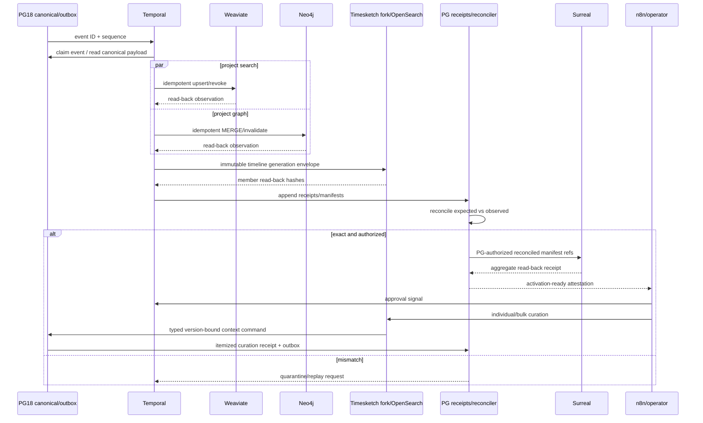

# R09 — Cross-Store Events, Receipts, Reconciliation and Final Integration

> Executable lane guide · 2026-08-25 schema reconciliation
>
> Governing rulings: D-073 Surreal final governed aggregation; D-077 Temporal
> durability/ref-only payloads; D-078 universal PG CDC/outbox and returned receipts;
> D-080 PG18 authority with rebuildable stores; D-081 bounded workstreams;
> D-084/D-085 and ADR-0060 maintained Timesketch fork with governed round-trip curation.

## Purpose and authority

Agno/AgentOS is a replaceable execution and orchestration adapter, not a truth authority. It may
invoke this lane only through platform-owned governed contracts; its sessions, memories, tool
outputs and generic database facilities cannot establish or mutate canonical state.

Provide the one integration/control contract that proves PostgreSQL, Weaviate, Neo4j,
the maintained Timesketch fork/OpenSearch, and Surreal agree without confusing projection
success, visual placement, or operator curation with factual authority.
PostgreSQL 18 is the canonical event, cursor, receipt, manifest and activation-control
plane. Weaviate is search only. Neo4j is the Semantica-originated governed semantic
graph through a separate projector. Timesketch/OpenSearch is a rebuildable timeline serving
and context-curation surface populated from immutable PG projection generations. Surreal is
the final governed temporal-graph/walk/analysis aggregation and consumes only PG-authorized
reconciled manifests.

R09 is the final integrator lane required by D-081. It owns gaps between store lanes;
no lane may declare completion merely because its local tests pass.

## Scope

In scope:

- Universal PG CDC/outbox envelope and ordered per-sink delivery.
- Common append-only projection receipts.
- Expected and observed manifests, reconciliation runs and quarantine.
- Cross-store contract/version registry and source-lineage probes.
- Activation attestations and separately gated reader cutovers.
- Immutable Timesketch projection-generation membership, fork/OpenSearch read-back, and
  individual/bulk curation round-trip receipts.
- Surreal intake of PG-authorized reconciled manifests.
- End-to-end golden corpus, failure/replay/rebuild and horizon proofs.

Out of scope:

- Canonical domain DDL owned by another lane.
- Store-specific schema/business logic beyond shared contract conformance.
- Establishing facts from external-store observations.
- n8n-managed durable retry/cursors.
- Destructive cleanup or legacy deletion.

## Owned surfaces

- PG projection-event/outbox, sink cursor/lease, receipt, manifest,
  reconciliation-run, quarantine and activation-attestation families.
- Canonical event/receipt serialization library or contract package.
- Final integrator tests, golden fixtures and live acceptance report.
- Surreal admission gate contract (not Surreal domain schema internals).
- Timesketch/OpenSearch projection and curation-boundary conformance (not canonical timeline
  domain DDL owned by its PG lane).
- Cross-lane contract matrix and unresolved-gap register.

## Authority and ownership boundaries

| Surface | Authority | May write | Must return |
|---|---|---|---|
| PG18 + pg_duckdb/PostGIS/pgvector | canonical data/control | owning PG lane/transaction | canonical event + audit |
| Weaviate | rebuildable search | R05 projector | PG receipt + observed manifest |
| Neo4j evidence | rebuildable semantic graph | R06 separate projector | PG receipt + node/edge manifest |
| Timesketch fork + OpenSearch | rebuildable timeline serving/context-curation client | timeline projector only; fork submits typed PG commands, never canonical writes | PG generation/read-back receipt + itemized curation receipt |
| Surreal governed target | final rebuildable aggregate/walk | Surreal projector | PG receipt + aggregate manifest |
| n8n | visual/business coordination | governed APIs/signals only | attributable request/signal |
| Temporal | durable sequencing/retry/history | activities through owned APIs | workflow/activity refs |

## Upstream and downstream contracts

### Canonical projection event

Every event is a complete immutable row, not a notification payload dependency:

- event ID, monotonically comparable sequence, event/schema version;
- aggregate kind/ID and operation (`activate`, `supersede`, `revoke`, `rebuild`);
- matter/case constant appropriate to D-072 one-owner scope;
- canonical assertion/promotion/review and source-anchor/generation IDs;
- source family and authority class, including `candidate/context-only` and
  evidence-approved/governed states without collapsing either;
- authority, temporal and horizon predicate fields;
- expected target set and projection-policy revision;
- canonical payload hash and prior/superseding event;
- transaction/audit timestamp.

DB trigger/transactional logic guarantees no committed governed change without its
event. Notifications contain only event ID/sequence hints.

### Common PG receipt

Minimum fields:

- receipt ID, sink, event ID/sequence, idempotency key;
- projection/schema revision and worker/build identity;
- canonical object/source/promotion IDs;
- target namespace/database/collection, kind and object ID;
- immutable projection-generation/member ID and expected source version when applicable;
- expected/observed payload hash and optional store-specific hashes;
- status: `pending`, `attempted`, `succeeded`, `failed_retryable`,
  `failed_terminal`, `quarantined`, `superseded`;
- attempt, started/finished/observed timestamps;
- bounded error code/digest, previous/superseding receipt;
- reconciliation-run and manifest IDs.

Receipts are append-only; a current-status view is derived. A store API acknowledgement
does not equal success until read-back observation is hashed and receipted.

### Manifest family

1. Canonical input: ordered event IDs/payload hashes/source-anchor hashes.
2. Weaviate: object IDs, chunk/source/embedding generations, authority/horizon fields,
   payload/vector hashes and active state.
3. Neo4j: node IDs/property hashes; edge IDs/endpoints/independent anchor hashes;
   authority/temporal state and constraint revision.
4. Timesketch/OpenSearch: immutable generation/member IDs, stable source/version IDs,
   required `datetime`/`message`/`timestamp_desc` mapping, authority/badge fields, temporal
   uncertainty, expected/observed document hashes, saved governed annotations and active state.
5. Surreal: aggregate IDs, canonical PG bindings, referenced graph/search IDs,
   approved span/content membership and walk-policy revision.
6. Reconciliation: expected/observed counts, ordered membership hash, content hash,
   orphan/unresolved/duplicate/stale-active counts and cursor high-water mark.

Canonical serialization is versioned once: UTF-8, key ordering, timestamp precision,
null representation, numeric/decimal encoding, geometry/WKB rules and hash domain tags.

## Temporal and n8n responsibilities

Temporal owns per-event/per-sink workflow identity, durable sequence, heartbeats,
leases/cursors, bounded retry, fan-out/fan-in, reconciliation activities, quarantine and
approved activation execution. Activity payloads contain references/IDs only; content,
raw files, vectors and manifests live in their stores and are hash-verified by reference.

n8n owns operator-visible coordination: start/request workflows, render receipts/gaps,
notify, collect reasoned approval/rejection and send Temporal signals. n8n does not own
outbox polling, durable retry, fan-out loops, hash computation, direct store writes,
cursor advancement or authority decisions.

## Timesketch writer fences and round-trip rule

The maintained fork has two separately authenticated, least-privilege boundaries. Neither boundary
may share credentials with the other:

| Boundary | Exclusive writer | Enforced denial |
|---|---|---|
| Immutable PG generation → Timesketch/OpenSearch | versioned timeline projector service role, consuming a sealed `timeline_projection_generation` | fork UI, analyzers, stock importers, generic agents and operator identities have no direct OpenSearch/core-event write or projection-control grants |
| Fork curation → PG context ledger | authenticated timeline-curation command API, writing `timeline_curation_batch`/`timeline_curation_item` and typed context results | fork/OpenSearch has no PG table credentials; command role cannot update/delete raw context, evidence, custody, fact, approved timeline, projection-generation or receipt rows |

Every projected member binds a deterministic stable ID, exact PG object/version, immutable generation,
authority class, source lineage, and expected content hash. Candidates from any context family—including
AI chats—may be visible with unmistakable `candidate/context-only` status. Evidence-approved entries may
also be visible, but their authority badges and governed source-opening links are mandatory and cannot be
overridden by fork-local fields.

Every individual or bulk edit is an immutable attributable PG batch with an idempotency key, actor,
rationale, expected generation/source version, typed operation, per-item before/after hash, validation
result, and `accepted`/`rejected`/`conflict`/`no_op` receipt. Partial success is explicit; strict atomic
mode is all-or-nothing. Undo appends a compensating batch linked to the original.

An edit targeting an evidence-approved/governed entry can only append a context-layer
`timeline_amendment_candidate` linked to the exact approved version and evidence/fact lineage. The
approved entry remains byte-for-byte and version-identical, active, and unmodified until independent
re-review and R09 reconciliation authorize a governed successor. The fork displays an accepted result
only after the resulting PG outbox event is projected in a new immutable generation and read back.

## Surreal final-admission rule

Surreal consumes the canonical governed event plus an R09 reconciliation attestation.
It may reference Weaviate/Neo4j object IDs, but every aggregate independently binds to
canonical PG assertion/promotion/source anchors. It must not scrape stores or accept
their discoveries as facts. Partial-source approval exposes only the manifest and
approved spans; full content requires source-level approval. Mismatch/revocation
quarantines the projection and fails walk retrieval closed.

## Invariants

1. PG is sufficient to rebuild every external store.
2. No canonical commit requiring projection lacks a complete outbox event.
3. Each sink has an independent cursor; one sink cannot advance another.
4. At-least-once delivery plus deterministic IDs yields exactly one logical object.
5. Every attempt and observation returns an append-only PG receipt.
6. Activation requires read-back, exact manifests and zero unresolved source anchors.
7. Counts alone never establish parity.
8. Surreal accepts only PG-authorized reconciled manifests.
9. A graph/search/Surreal discovery returns to PG candidate governance.
10. Horizon filters apply before search/traversal/retrieval on every store.
11. Revocation/supersession propagates without deleting history.
12. No legacy schema/store is deleted during reconciliation.
13. Every Timesketch/OpenSearch document belongs to one immutable PG projection generation and is
    rebuildable without fork-local canonical state.
14. Any context family may contribute a candidate, while evidence-approved entries coexist only with
    explicit, queryable authority badges and exact governed lineage.
15. Fork-originated edits round-trip through typed PG commands and append-only item receipts; no fork,
    analyzer, importer, OpenSearch API, or generic agent can write canonical state directly.
16. Any edit to an approved entry creates an amendment candidate; acceptance appends a governed
    successor and new projection generation, never an in-place update.

## Evidence-backed current gaps

Evidence labels: **source-proven** means tracked code/configuration; **dated live snapshot**
means observed read-only on 2026-08-26 but not mutation/execution/security/parity proof;
**production-reported** means an older dated handoff; **stale** conflicts with newer evidence;
and **unverified** was outside the snapshot or still requires R14 attestation.

- **Critical · source-proven:** Weaviate is anonymously reachable on tailnet-bound REST
  and gRPC ports (`deploy/data-weaviate.yaml:16-30`,
  `deploy/data-weaviate-native-v1.yaml:7-16`). This bypasses application-level horizon,
  actor and audit controls even though the native query itself prefilters correctly
  (`server/core/evidence_vector_store.py:344-410`). R09 cannot attest a governed read
  boundary while direct unfiltered access remains possible.
- **Critical · source-proven:** all newly inserted normalized chunks are automatically
  queued (`sql/0026_realization_event.sql:511-541`), while the projector does not enforce
  the selected route decision and hardcodes every eligible object active
  (`server/evidence/vector_projection.py:145-176,187-217`). R09 currently has no
  promotion/route receipt with which to detect that authority mismatch.
- **High · source-proven:** Graphiti hostfix exposes direct MCP ports 8071/8073
  (`deploy/data-graphiti.yaml:99-118`, `deploy/data-graphiti-case.yaml:86-97`) and tracked
  clients send no authorization (`server/analysis/graphiti_case_client.py:32-65`,
  `workbench/api/app/repo/graphiti_client.py:76-85`). Direct callers can bypass
  Workbench/gateway group and tool selection.
- **High · source-proven:** PG pass roles are not bound by any tracked server caller;
  their migration states that prior superuser use made them inert and that
  `pass_reader` exposes all walks without RLS (`sql/0029_pass_grants.sql:20-27,43-52,145-153`).
  The later production handoff reports a non-superuser `agno_app` cutover
  (`docs/HANDOFF-2026-08-24-n8n-pipeline-golive.md:18-23`), but the 2026-08-26 snapshot
  observed exec still connected as superuser `ai` and RLS enabled on 0 of 143 inspected
  evidence/working/analysis base tables. Exact grants and denial behavior were not exercised.
- **High · source-proven:** `/v1/ingest` reserves a durable receipt but dispatches work
  only through an in-process `asyncio` task (`server/api/ingest_routes.py:85-109,113-159`).
  No tracked startup recovery consumer was found, so a crash after 202 can strand a
  running receipt.
- **High · source-proven:** Temporal's store activity claims its retry replaces the
  internal loop (`server/temporal/activities.py:253-270`), but the called store path
  still performs up to four internal attempts (`server/evidence/store.py:85-89,206-225,441-474`)
  and Temporal retries the activity four times
  (`server/temporal/workflows.py:111-116,256-267`). The combined budget can reach sixteen
  DB transactions.
- **High · source-proven:** CI runs unit `pytest -q` only
  (`.github/workflows/validate.yml:41-48`). The only marked integration test is opt-in
  and skips unless `HORIZON_SCRATCH_LIVE=1`
  (`tests/integration/test_ingest_scratch_live.py:21-30`). The latest dated handoff
  reports 43 targeted tests and says the full suite was not rerun
  (`docs/HANDOFF-2026-08-24-ingest-testing.md:4-6`).
- **Source-proven:** ADR-0052 identifies the universal PG CDC/outbox as the missing
  spine; current paths still include polling/inline projection exceptions, and
  downstream systems have lane-specific status fields rather than one observed common
  receipt/activation contract.
- **High · source-proven:** native activation's parity control is useful, but its
  manifests and reconciliation receipt are filesystem JSON
  (`server/evidence/native_activation.py:182-219`), not a canonical PG receipt. The
  Weaviate object schema omits exact original locator and promotion/review revision
  (`server/core/evidence_vector_store.py:57-121`), so the parity hash does not cover the
  complete R09 lineage contract.
- **Critical · source-proven:** no universal `projection_receipt` or
  `aggregation_manifest` relation/writer was found. The required R09 contract demands a
  PG manifest containing exact source/fact/promotion revisions, target IDs, membership/
  content hashes, clocks, governance state and required receipts
  (`docs/reviews/2026-08-25-schema-audit/RECONCILIATION-DOMAIN-WORKSTREAMS.md:202-212`).
- **High · source-proven scope limit:** pgvector is currently used for the context-chat
  embedding cache (`sql/0024_chat_conversation_and_message.sql:187-200`), and the only
  tracked pg_duckdb workload is startup R2-secret creation
  (`server/core/session.py:261-291`). Neither has governed workload receipts or a place
  in the current universal reconciliation plane.
- **Production-reported, not refreshed:** the Aug-24 audit found Semantica unwired, no
  Neo4j evidence writer and empty candidate/promotion relations. The 2026-08-26 snapshot
  did not query those relations or Neo4j, so the counts remain dated evidence.
- **Source-proven:** `docker/surreal-phase1-runner/.../runner.py` proves fixture guards,
  hashes, quarantine, walk/rewalk and export parity, but consumes a synthetic manifest
  rather than production PG/Weaviate/Neo4j events.
- **Dated live snapshot, incomplete:** both Weaviate services were ready on v1.38.7, but
  exec's native-evidence flag evaluated false; Graphiti applications were running and exec
  still carried `GRAPHITI_MCP_URL`; the legacy Surreal URL timed out while the Phase-1
  synthetic proof remained reachable. Store high-water marks, native alias/object parity,
  Neo4j evidence state, production Surreal admission and cross-store manifests were not
  inspected. D-078/D-080 remain target rulings, not runtime proof
  (`../COMPLETE-CODEBASE-AUDIT.md`, read-only live-parity snapshot and evidence limitations).
- **New accepted design, implementation unverified:** D-084/D-085 and ADR-0060 define the
  maintained Timesketch fork, immutable PG projection generations and governed edit round-trip.
  The 2026-08-26 audit snapshot did not establish deployed fork/OpenSearch identities, PG
  generation/curation writers, read-back receipts, direct-write denials, rebuild parity or live
  amendment re-review. R09 must not attest this projection from the accepted decision alone.

### Applicable audit gaps

The deduplicated register assigns these blocking or mandatory findings to R09:
[`GAP-005`](../AUDIT-GAP-REGISTER.md), [`GAP-007`](../AUDIT-GAP-REGISTER.md),
[`GAP-008`](../AUDIT-GAP-REGISTER.md), [`GAP-009`](../AUDIT-GAP-REGISTER.md),
[`GAP-010`](../AUDIT-GAP-REGISTER.md), [`GAP-012`](../AUDIT-GAP-REGISTER.md),
[`GAP-020`](../AUDIT-GAP-REGISTER.md), [`GAP-021`](../AUDIT-GAP-REGISTER.md),
[`GAP-026`](../AUDIT-GAP-REGISTER.md), and [`GAP-034`](../AUDIT-GAP-REGISTER.md).

## Implementation phases

### Phase 0 — Contract freeze and gap matrix

Freeze event/receipt/manifest serialization, authority map, source-anchor envelope,
store revision vocabulary and test corpus. Produce field-level matrix:
canonical owner → event emitter → each consumer → receipt → verifier.

### Phase 1 — PG control plane

Add outbox, per-sink cursor/lease, receipt, manifest, reconciliation and quarantine/
attestation families through new migrations. Enforce transactional event emission and
append-only receipts.

### Phase 2 — Temporal consumer skeleton

Implement reference-only claim/read/dispatch/read-back/receipt workflow with fake sinks,
then live store adapters. Prove crash/replay and independent cursors.

### Phase 3 — Weaviate and Neo4j convergence

R05/R06 consume the frozen contract into inactive revisions. Reconcile independently,
then cross-check shared canonical source/promotion IDs and high-water mark.

### Phase 4 — Timesketch generation and curation convergence

Deploy the maintained fork/OpenSearch behind separate projector and command identities. Project a
sealed inactive generation containing any-context candidates and evidence-approved entries with exact
authority badges. Reconcile document membership/content and source-opening links. Exercise individual,
mixed-validity bulk, strict-atomic and compensating batches; prove approved-entry edits create amendment
candidates and cannot alter the approved row or active generation in place.

### Phase 5 — Surreal governed admission

Replace synthetic-only manifest input with PG-authorized reconciled manifest references.
Preserve the phase-1 projection guard/quarantine behavior. Write aggregates and return
read-back receipts.

### Phase 6 — End-to-end reconciliation

Run golden corpus, planted-future, partial failure, revocation, source drift and empty-
store rebuild, including a clean Timesketch/OpenSearch rebuild from a pinned PG generation. Resolve
every gap; do not waive unresolved anchors.

### Phase 7 — Separate activation gates

Approve Weaviate alias, Neo4j evidence reader, Timesketch fork/importer/curation command surface,
and Surreal walk/analysis reader separately. Each gate records an immutable attestation, pinned
deployment/image revision, active generation and rollback target. Surreal is last.

## Test matrix

| Test | Proof |
|---|---|
| Transactional outbox | rollback leaves neither canonical change nor event |
| Cursor independence | Neo4j failure does not advance Neo4j or stall Weaviate |
| Replay | duplicate delivery yields one logical target and append receipt |
| Read-back | false API success is detected by observed hash mismatch |
| Partial batch | missing objects only are retried |
| Exact lineage | Surreal edge traverses to PG fact/promotion/span/original/H1 |
| Horizon | planted future fact absent in all early-store queries |
| Revocation | stale-active count becomes zero without history deletion |
| Orphans | zero unresolved target/source/promotion references |
| Manifests | count + membership + content hashes exact at same sequence |
| Rebuild | all external stores recreated from PG authority |
| Surreal admission | unreconciled manifest is rejected/quarantined |
| Terminal drift | walk retrieval fails closed and follows ruled checkpoint/rewalk path |
| Store perimeter | direct unauthenticated Weaviate and Graphiti calls are rejected |
| Projection eligibility | queued-but-unpromoted/denied-route chunks never become active |
| Complete lineage hash | manifest includes exact locator and promotion/review revision |
| PG manifest durability | loss of filesystem artifacts does not erase activation proof |
| Extension workload census | pgvector/pg_duckdb owners, workloads and receipts are explicit |
| Role isolation | cross-walk, canonical-table and cross-sink writes fail under runtime roles |
| Receipt crash recovery | crash after 202 resumes or terminally reconciles the same identity |
| Retry budget | injected transient failures produce the declared bounded attempt count |
| Integration enforcement | CI fails when any required live lane is skipped or emits no evidence |
| Timesketch generation immutability | sealed generation/member rows reject UPDATE/DELETE; a successor generation is appended |
| Any-context visibility | each supported context family projects as candidate/context-only; evidence-approved entry coexists with distinct authority badge and lineage |
| Projection writer fence | only projector identity can populate Timesketch/OpenSearch; UI/analyzer/importer/generic-agent direct writes fail |
| Curation writer fence | fork has no PG table credentials; only typed command API can append curation batches/items and context results |
| Individual edit round-trip | accepted context edit appears only after PG receipt/outbox and a new reconciled generation |
| Approved-entry edit | amendment candidate is appended; approved member/fact/evidence hashes and active version remain unchanged |
| Mixed bulk edit | itemized accepted/rejected/conflict/no-op results are exact; no accepted-summary laundering |
| Strict bulk edit | one invalid/stale item leaves the entire atomic batch unapplied |
| Stale/replayed edit | expected-version/generation conflict fails closed; idempotent replay does not duplicate effects |
| Compensating undo | reversal links original batch and preserves both histories |
| Timesketch rebuild | clean fork/OpenSearch state reproduces generation count/membership/content, governed annotations and source links from PG |
| Timesketch rollback | prior fork image/generation/reader route restores without reverting or mutating PG curation/approved history |

## Live acceptance

- A real governed event is consumed by independent Weaviate and Neo4j workflows and
  returns read-back PG receipts.
- Reconciliation attests exact membership/content at one named PG sequence.
- Surreal refuses the event before attestation and accepts it afterward.
- Any Surreal aggregate/edge resolves through receipts to the canonical PG assertion,
  promotion, exact source locator/generation and original/custody hash.
- A planted future fact is absent in PG eligible view, Weaviate prefilter, Neo4j
  pre-traversal predicate and Surreal walk retrieval at the early horizon.
- The planted corpus includes denied-route and unpromoted chunks and proves they are
  absent from target stores, not merely hidden at read time.
- Live failure/retry, revocation, quarantine, rebuild and each reader rollback are
  observed rather than inferred.
- Direct-store probes prove Weaviate and Graphiti cannot bypass the governed API/gateway
  boundaries; datastore reader and projector identities are distinct.
- A crash immediately after receipt reservation demonstrates deterministic recovery or
  terminal reconciliation with no indefinitely running receipt.
- CI publishes current PG/Weaviate/Neo4j/Surreal/Temporal receipts and fails closed when
  the live suite is skipped.
- A pinned maintained-fork image imports one sealed PG generation containing candidates from every
  supported context family plus evidence-approved entries; required authority badges, temporal
  uncertainty and source-opening links reconcile exactly in Timesketch/OpenSearch.
- Live direct-write probes prove that fork UI/analyzers/stock importers cannot write OpenSearch core
  events and that the fork identity cannot write PG tables. Only the projector and typed curation API
  identities succeed within their distinct grants.
- Individual and mixed/atomic bulk edits return itemized PG receipts. An approved-entry edit creates a
  linked amendment candidate, leaves the approved version unchanged, completes independent re-review,
  and appears only as an appended governed successor in a new reconciled generation.
- A clean Timesketch/OpenSearch rebuild reproduces the active generation; rollback to the recorded prior
  image/generation/reader binding preserves every curation batch, amendment candidate, approved version
  and receipt.

### Stop gates

Stop any external-store or Surreal reader activation while any condition holds:

- universal PG projection receipts/aggregation manifests or exact lineage fields are absent;
- direct Weaviate/Graphiti access bypasses governed actor, horizon, group or tool policy;
- runtime roles/RLS, projection eligibility or per-sink cursor isolation are unproved;
- receipt reservation is not paired with crash-recoverable execution or retry budgets multiply;
- store high-water marks differ, a manifest is filesystem-only, or any live suite is skipped;
- the maintained fork is unpinned/unverified, a projected member lacks generation/authority/source
  bindings, or Timesketch/OpenSearch contains a document absent from the active PG generation;
- fork, UI, analyzer, importer or generic-agent identities can write projection/core-event state, or
  the fork can bypass the typed command API to write PG;
- an approved-entry edit can update approved evidence/fact/timeline state, bypass amendment re-review,
  or appear in the fork before PG receipt and new-generation reconciliation;
- any orphan, stale-active object, unresolved source/promotion anchor or unnamed gap remains.

## Migration and rollback

All PG changes use new additive numbered migrations. External writes target inactive
revision/collection/database namespaces. Timesketch/OpenSearch imports only sealed inactive PG
generations; curation remains disabled until generation/read-back reconciliation and both writer-fence
denial suites pass. Reader activation is never bundled with backfill. Rollback stops the affected
projector/command admission, restores the prior image plus alias/reader/generation binding and leaves
events, curation batches/items, amendment candidates, approved versions, receipts and manifests intact
for diagnosis/replay. Rebuild creates a clean serving target from a pinned PG generation; it never
promotes fork-local state into PG. Legacy and failed revisions are preserved; later removals go to
`to_be_deleted`, and only the owner deletes them.

## Risks

- Each store passes locally while cross-store anchors disagree.
- API acknowledgement mistaken for observed persistence.
- Cursor advancement before receipt durability.
- Surreal scraping projections and creating competing authority.
- Canonical serialization drift between languages/stores.
- Partial approval exposing whole source content.
- Activation at different high-water marks.
- n8n accidentally used as durable runner.
- Final-integrator responsibility diffused across lanes.
- Anonymous/direct store access invalidating an otherwise correct application predicate.
- Out-of-band runtime roles/grants that cannot be reproduced or audited from migrations.
- A durable receipt paired with non-durable execution, leaving false-running work.
- Nested retry policies multiplying load and obscuring the real attempt budget.
- Unit-only CI allowing configuration contracts to substitute for observed integration.
- Correct manifest parity over an incomplete object/authority envelope.
- Filesystem receipts being lost or diverging from the canonical PG audit plane.
- pgvector/pg_duckdb extension presence being mistaken for governed workload integration.
- Timesketch/OpenSearch curation or analyzer state being mistaken for accepted PG context or fact state.
- A bulk-success banner hiding rejected/conflicting items or an approved-entry mutation.
- A serving rollback restoring a stale generation without preserving the complete PG curation ledger.

## Agent instructions

- R09 integrator reads every R00–R14 handoff and owns the contract matrix/gap register.
- Do not implement another lane’s domain logic; reject or route gaps to its named owner.
- Require observed live proof and source traversal, not configuration or row counts.
- Keep Temporal payloads reference-only; keep n8n at coordination/UI boundaries.
- Apply D-084/D-085 and ADR-0060 to every Timesketch generation, curation command,
  amendment review, receipt, rebuild and rollback assertion.
- Never edit applied migrations, delete stores/files or collapse historical receipts.
- Preserve concurrent work and change only assigned surfaces.
- A lane is not done until R09 can consume and reconcile its handoff.

## Exact handoff checklist

- [ ] Field-level owner/emitter/consumer/receipt/verifier matrix complete.
- [ ] Event, receipt, manifest and serialization versions frozen.
- [ ] PG migration/application evidence and append-only grants attached.
- [ ] Runtime `current_user`, role membership, RLS and cross-walk denial evidence attached.
- [ ] Temporal workflow/activity IDs, queues, retry and cursor rules recorded.
- [ ] Crash-after-receipt and exact retry-budget evidence attached.
- [ ] n8n workflow IDs and signal-only boundary recorded.
- [ ] Weaviate expected/observed manifests exact.
- [ ] Queue/promotion/route authority is included in expected and observed manifests.
- [ ] Exact original locator plus promotion/review revision is hash-covered.
- [ ] Neo4j node and edge manifests exact with independent edge anchors.
- [ ] Maintained Timesketch fork/upstream base, image digest, Coolify revision and active immutable PG generation recorded.
- [ ] Timesketch/OpenSearch member/read-back manifests reconcile count, membership, content, authority badges and source links.
- [ ] Separate projector and curation-command identities pass direct OpenSearch/PG negative-write tests.
- [ ] Any-context candidate plus evidence-approved visibility tests pass without authority laundering.
- [ ] Individual, mixed/atomic bulk, stale/replay and compensating edit receipts are exact.
- [ ] Approved-entry edit appends an amendment candidate; unchanged approved hashes and governed-successor re-review are proved.
- [ ] Clean Timesketch/OpenSearch rebuild and prior-image/generation rollback are observed live.
- [ ] Surreal admission attestation and aggregate manifest exact.
- [ ] Universal PG `projection_receipt`/`aggregation_manifest` writers are source-traced.
- [ ] pgvector/pg_duckdb workload and receipt census is complete or explicitly empty.
- [ ] Cross-store high-water marks identical or explicitly bounded/caught up.
- [ ] Zero orphan, unresolved, duplicate and stale-active counts.
- [ ] Full lineage and planted-future tests pass live.
- [ ] Direct Weaviate/Graphiti bypass probes reject unauthenticated and over-privileged calls.
- [ ] CI live-integration job is required, non-skipped and publishes current receipts.
- [ ] Failure/replay/revocation/quarantine/rebuild evidence attached.
- [ ] Each activation approval and rollback target recorded separately.
- [ ] No unresolved gap lacks a named owner and blocking status.
- [ ] No legacy material was deleted.
