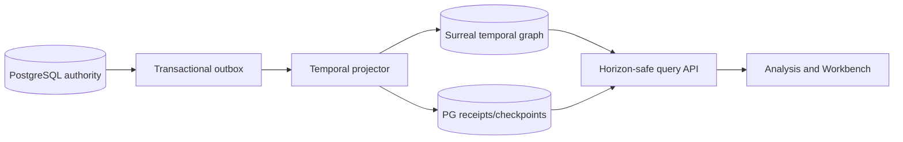

# R10 — SurrealDB Final Temporal Aggregation

## Purpose and authority

This lane implements D-073, D-078, D-080, and the bounded-workstream mandate in D-081: SurrealDB is the final governed, derived temporal-graph aggregation for walks and analysis. PostgreSQL remains the system of record for custody, normalized evidence, claims, facts, realizations, walk manifests, deltas, and legal governance. SurrealDB adds traversable temporal aggregation; it never creates authority, changes source clocks, or becomes the only copy of a fact. D-070 retires Graphiti; it is not a fallback or parallel belief store.

Agno/AgentOS is only an orchestration and execution consumer of these contracts. It is not an owner or origin of truth and may not author canonical PG rows or bypass the governed projector through a generic database/tool path.

## Scope

In scope: versioned projection contracts, outbox consumption, temporal vertices/edges, horizon-safe query surfaces, reconciliation receipts, rebuilds, and production cutover.

Out of scope: custody writes, normalization, entity/fact adjudication, belief formation, legal approval, or direct source ingestion.

## Owned surfaces

- A new Surreal database/namespace for the current projection contract; the retired read-only instance is not repurposed.
- PostgreSQL projection registry, outbox, receipt, checkpoint, and dead-letter families.
- Temporal worker workflows, reconciliation commands, dashboards, Graphiti write shutdown verification, and runbooks.
- Read APIs that declare projection version, scope, horizon, and consistency watermark.

## Contracts and keys

Upstream producers emit committed PostgreSQL outbox rows containing `event_id`, aggregate kind/id/version, the fixed singleton personal-case scope, `occurred_at`, `source_available_from`, disclosure tier, payload hash, schema version, and commit position. Existing Matter/CourtCase identifiers may be carried as source compatibility references, but never define a hierarchy, tenant boundary, or new projection identity. IDs in Surreal are deterministic from PostgreSQL type plus immutable PK; source PKs are never replaced by graph-local identities. The projector accepts only a PostgreSQL-authorized reconciled manifest, never an unverified raw CDC batch.

Downstream consumers receive a result plus `projection_version`, `checkpoint`, and `as_of`. Consumers must tolerate projection lag and may require a minimum checkpoint. Legal consumers may use only governed PostgreSQL references returned with the graph result.

## PostgreSQL events and receipts

- `projection_outbox`: append-only event written in the authoritative transaction.
- `projection_delivery_attempt`: append-only attempt/error telemetry.
- `projection_receipt`: unique `(projection_name, projection_version, event_id)`; records applied payload hash and Surreal transaction identity.
- `projection_checkpoint`: monotonic commit position per partition/version.
- `projection_reconciliation_run` and `projection_reconciliation_mismatch`: counted source/target hashes and discrepancies.
- `projection_dead_letter`: terminally classified failures; replay creates a new attempt, not a rewritten event.

## Temporal and n8n responsibilities

Temporal owns ordered delivery, retry policy, idempotency, checkpoint advancement, rebuilds, reconciliation, and terminal failure handling. Activities write Surreal and then the PostgreSQL receipt idempotently. A checkpoint advances only through a contiguous received prefix.

n8n may request a rebuild, present lag/mismatch alerts, and route human approval through authenticated APIs. It does not consume the outbox, mutate graph records, decide ordering, or hold the only retry state.

## Invariants

1. Every graph record resolves to immutable PostgreSQL IDs and a projection version.
2. The graph is fully rebuildable from PostgreSQL plus versioned projector code/configuration.
3. No future-visible node or edge is returned when `source_available_from > horizon`.
4. Temporal predicates are applied before traversal/ranking, never afterward.
5. `knowledge_time` is audit time and never a horizon predicate.
6. Claims, established facts, realizations, and walk beliefs remain distinct node/edge kinds.
7. A receipt cannot exist for a payload hash different from the outbox event hash.
8. Replays are idempotent; conflicting deterministic IDs fail closed.
9. Projection failure cannot roll back or modify authoritative PostgreSQL data.
10. No new Graphiti writes occur; any retained Graphiti data is legacy/read-only until owner-directed retirement.
11. Agno/AgentOS can request governed projection work and consume governed results, but cannot author PostgreSQL truth or write Surreal directly through generic agent tools.

## Implementation phases

1. Freeze and publish the projection schema/version, deterministic ID rules, and event registry.
2. Add universal PostgreSQL CDC/outbox/receipt/checkpoint structures and producer contract tests.
3. Provision a fresh Surreal target and least-privilege service identity.
4. Implement snapshot backfill and incremental Temporal projector.
5. Run shadow projection; reconcile counts, hashes, temporal edges, and random traversals.
6. Enable horizon-safe read API for non-legal consumers behind a feature flag.
7. Gate legal consumers on governed PostgreSQL references and checkpoint health; cease Graphiti writes and prove zero callers.
8. Cut over reads; retain prior systems read-only. Anything later retired is moved to `to_be_deleted`; nothing is deleted by agents.

## Current gaps

- Final projection schema/version registry and edge vocabulary need implementation confirmation.
- Outbox coverage across all authoritative aggregates must be proven.
- Horizon query tests must cover graph expansion, not only starting vertices.
- Production lag, mismatch, and dead-letter objectives need owner-approved thresholds.
- The retired Surreal export must remain isolated from the new target.
- Graphiti callers and any legacy state that must be preserved need a signed inventory.

### Audit evidence snapshot — repository versus live (2026-08-26)

| Surface | Repository evidence | Live/read-only evidence | Status and gap |
|---|---|---|---|
| Retired Surreal | `server/core/session.py:26`, `:94`, and `:353` retain the legacy URL and constructor; `deploy/exec.yaml:98-107` labels it parked/read-only parity access. | Exec-tier still carries `SURREALDB_URL=ws://100.119.96.29:8000/rpc`; a desktop GET to the old host `/health` timed out on 2026-08-26. | **Unverified/medium:** static direct-symbol census found no caller beyond the constructor, but zero-call telemetry and the old service's read-only state were not proved live. |
| Phase-1 target | `deploy/compose.surreal-phase1.yaml:1-48` defines a separate internal network, `--deny-all`, restricted RPC/functions, read-only filesystem, and an isolated synthetic volume. | Coolify reported `data-surreal-phase1-t0-r1` `running:healthy`; last finished deployment was commit `4fc3b9d1f984a5603544c3a9c026d5bdbd7aa15b` on 2026-08-25. | **Partial:** the isolated experiment is deployed, but it is not the production D-073 projector and no projection receipt/checkpoint evidence was observed. |
| Production projection | This guide specifies outbox, delivery, receipt, checkpoint, mismatch, and dead-letter families, but the inspected runtime census found no production Surreal projector/workflow implementing them. | No live PG-to-Surreal reconciliation run, count/hash comparison, checkpoint, or authorized-manifest receipt was supplied. | **Stop:** do not call R10 implemented or enable consumers. |
| Synthetic versus production proof | `docker/surreal-phase1-runner` exercises fixture guards, hashes, quarantine, walk/rewalk, and export parity against a synthetic manifest; no universal production `projection_receipt` or `aggregation_manifest` writer was found (cross-lane census recorded in `R09-cross-store-reconciliation.md:178-251`). | The healthy Phase-1 app supplies no evidence that real PG/Weaviate/Neo4j governed events are admitted or rejected by production policy. | **High false-confidence risk:** fixture parity cannot satisfy D-078/D-080 admission. |

### Audit gap backlinks

R10 owns or shares the following open findings in the [audit gap register](../AUDIT-GAP-REGISTER.md):
[GAP-009](../AUDIT-GAP-REGISTER.md), [GAP-010](../AUDIT-GAP-REGISTER.md),
[GAP-011](../AUDIT-GAP-REGISTER.md), [GAP-019](../AUDIT-GAP-REGISTER.md), and
[GAP-021](../AUDIT-GAP-REGISTER.md). Their register acceptance gates are mandatory lane handoff
conditions; this guide does not claim they are implemented.
| Graphiti retirement | Canon records the retirement direction at `docs/PROJECT_CANON.md:217`; `server/agents/providers.py:194-212` still attaches Graphiti whenever `GRAPHITI_MCP_URL` is non-empty. | Exec-tier currently has `GRAPHITI_MCP_URL=http://100.91.190.107:8071/mcp`; both Graphiti Coolify applications reported `running:unknown`. | **High drift:** zero new Graphiti writes/callers is not established. |
| Agno authority boundary | `server/agents/providers.py:147-158` builds a writable generic `DatabaseContextProvider`, and `:192` distributes its tools in the shared agent tool bundle. | Exec-tier uses the PG superuser identity `ai`. No live denial proof showed that generic agent tools cannot author canonical or projection state. | **Critical authority drift:** the runtime adapter has a write-capable path to the truth store; R10 must fail closed until it is removed or constrained to governed, least-privilege domain commands. |

## Test matrix

| Test | Required result |
|---|---|
| Duplicate delivery | One graph mutation and one matching receipt |
| Out-of-order event | Buffered/retried; checkpoint does not skip |
| Hash conflict | Terminal failure; no overwrite |
| Future node/edge | Excluded before traversal |
| Revoked/disclosed scope | Query denies or filters at source |
| Full rebuild | Same canonical hashes/counts as incremental target |
| Surreal outage | Temporal retries; PostgreSQL commits remain healthy |
| Schema-version mismatch | Fail closed and alert |
| Unreconciled CDC batch | Surreal rejects it; no receipt/checkpoint |
| Graphiti write attempt | Denied/alerted after cutover |
| Retired-store caller telemetry | Zero connection attempts from production identities during the agreed soak window |
| Phase-1 network escape | External ingress and unauthorized RPC/function calls fail closed |
| Authorized-manifest gate | Raw/unreconciled CDC input is rejected and cannot advance a checkpoint |
| Synthetic-manifest substitution | Rejected for production admission; only a PG-persisted governed manifest can activate an aggregate |

## Live acceptance

- Deploy the new Surreal target and Temporal worker through the production path.
- Project a custody-backed representative corpus including first-party, acquired-third-party, and AI-export messages.
- Demonstrate exact receipts and a zero-unexplained-mismatch reconciliation.
- Prove a future fact cannot appear through a one-hop or multi-hop query at an earlier horizon.
- Stop Surreal, ingest authoritative data, restore service, and demonstrate catch-up without duplicates.
- Record endpoint, deployment revision, projection version, checkpoint, test evidence, and rollback owner.

### Stop and acceptance gates

- **STOP-R10-1:** do not reuse the parked `100.119.96.29` store or treat the healthy Phase-1 experiment as production aggregation.
- **STOP-R10-2:** do not cut reads to Surreal until an immutable PG-authorized manifest, matching receipt, contiguous checkpoint, and zero-unexplained-mismatch reconciliation exist.
- **STOP-R10-3:** do not certify Graphiti retirement while the live exec environment still supplies `GRAPHITI_MCP_URL` or either Graphiti application can receive writes.
- **STOP-R10-4:** do not enable the projector or consumers while Agno/AgentOS agents retain a generic write-capable PG or direct-Surreal tool path.
- **ACCEPT-R10:** require a pinned deployment SHA, projection contract/version, least-privilege identity, rebuild proof, one-hop and multi-hop horizon traps, outage catch-up, zero-caller Graphiti/legacy-Surreal evidence, and a demonstrated rollback. Health alone is insufficient.

## Migration and rollback

Use expand/backfill/shadow/read-cutover. Never dual-author semantic truth. Rollback switches readers to PostgreSQL/previous approved read surface and pauses the projector; authoritative writes continue. A faulty projection is rebuilt under a new projection version. Do not truncate, overwrite, or delete the prior Surreal data.

## Risks

- Silent horizon leakage during traversal.
- Projection schema drift or partial receipt/checkpoint advancement.
- Treating graph proximity as factual authority.
- Reusing the retired Surreal store and mixing incompatible generations.
- Business automation bypassing the durable projector.

## Agent instructions

Read the root and closest `AGENTS.md`, project canon, D-069–D-081, and the projection ADRs before implementation. Do not edit applied migrations. Use versioned forward migrations, least privilege, deterministic replay, and live integration tests. Do not delete files or data; quarantine retirement candidates in `to_be_deleted` only after owner approval.

## Exact handoff checklist

- [ ] Projection contract and event registry are versioned and reviewed.
- [ ] Every upstream aggregate and timestamp field is mapped.
- [ ] PostgreSQL outbox, receipts, checkpoints, mismatches, and dead letters are deployed.
- [ ] Temporal workflow/activity versions and retry classifications are documented.
- [ ] Surreal constraints/indexes and deterministic ID mapping are deployed.
- [ ] Snapshot and incremental reconciliation evidence is attached.
- [ ] Horizon, disclosure, replay, outage, and conflict tests pass live.
- [ ] Dashboards, alerts, rebuild command, and rollback switch are verified.
- [ ] No consumer treats Surreal as authority.
- [ ] Graphiti has zero new writes/callers and retained state is inventoried read-only.
- [ ] Prior stores remain read-only; no deletion occurred.
