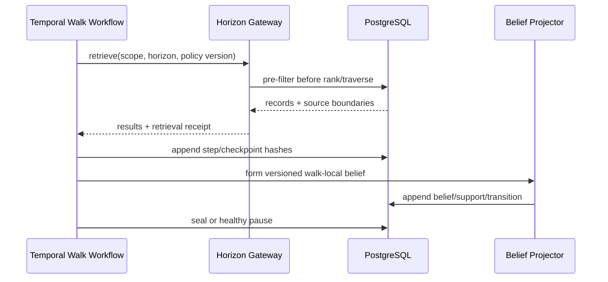

# R11 — Horizon-Safe Walks and Paired Delta

## Purpose and authority

This lane implements D-069, D-070, D-073, and the related D-069–D-081 rulings for reproducible ignorant/hindsight walks. The ignorant walk advances through successive knowledge horizons; the hindsight walk sees the governed complete corpus. Their version-pinned difference is the deliverable. Beliefs are walk-local analysis, not facts. Surreal is the final governed temporal aggregation for walk/analysis; Graphiti is retired.

Agno/AgentOS may execute or coordinate a walk only through the governed workflow and retrieval contracts. It is not a truth authority: PostgreSQL custody/evidence/governance remains canonical, and an agent-generated belief, tool write, or runtime session record cannot establish or modify truth.

## Scope

In scope: walk identity/lifecycle, horizon policy, checkpoints, retrieval manifests, belief versions, walk pairing, delta findings, court anchors, resumability, terminal sealing, and rewalk lineage.

Out of scope: extraction, normalization, fact adjudication, custody mutation, or drafting legal work product.

## Owned surfaces

- PostgreSQL `walk`, `walk_step`, `walk_checkpoint`, `walk_seal`, and `rewalk_edge` families.
- Walk-local `belief`, `belief_support`, and `belief_transition` families.
- `walk_pair`, `delta_snapshot`, `delta_finding`, typed basis links, and established-fact anchors.
- Horizon-enforcing retrieval gateway and replay/reconciliation tooling.

## Upstream and downstream contracts

Upstream retrieval surfaces bind the fixed singleton personal-case scope server-side and accept agent role, horizon, disclosure context, projection version, and deterministic paging/ordering inputs. Existing Matter/CourtCase IDs are compatibility references only and cannot select, partition, or multiply walk scope. Every result carries immutable record ID/version, `occurred_at`, `source_available_from`, disclosure tier, and retrieval-store receipt.

Downstream analytical consumers receive immutable walk/checkpoint IDs and delta versions. Legal consumers receive only court-eligible delta findings with established-fact anchors; walk belief text alone is never a legal fact.

## PostgreSQL events and receipts

- `walk_command_receipt`: unique command/idempotency key and accepted policy version.
- `retrieval_receipt`: query hash, stores consulted, pre-filter predicates, result IDs/versions, counts, and store checkpoints.
- `walk_checkpoint`: step/horizon, state hash, trace hash, belief-set hash, retrieval-receipt references, projection reconciliation hash.
- `walk_lifecycle_event`: started, advanced, paused, resumed, sealed, terminally failed.
- `walk_seal`: immutable terminal snapshot and reason.
- `delta_computation_receipt`: paired checkpoints, algorithm/config/input hashes, finding-set hash.
- `court_eligibility_event`: reviewer decision over fact-anchored delta version.

## Temporal and n8n responsibilities

Temporal owns walk steps, timers, retries, pause/resume signals, checkpoint persistence, terminal classification, paired execution, and delta computation. Retry never advances a horizon twice. Resume is allowed only after exact projection and state reconciliation.

n8n may collect a human request, schedule a business review, notify on pause/failure, and display approval state. It cannot mutate checkpoints, choose a replacement horizon, reopen a sealed walk, or mark a delta court-eligible directly.

## Invariants

1. Horizon filtering occurs in PostgreSQL, Weaviate, and every graph store before ranking or traversal.
2. Weaviate uses dictionary filters; FilterExpr lists are prohibited.
3. `source_available_from` controls visibility; `knowledge_time` never does.
4. The ignorant walk horizon is monotonic and checkpointed at every step.
5. Checkpoints reference exact result IDs/versions, state, trace, projection, model, prompt, and policy hashes.
6. Healthy pause preserves identity only after exact reconciliation.
7. Drift, revocation, mismatch, or terminal integrity failure seals the walk permanently.
8. A retry after terminal failure creates a new walk with an attested `rewalk_of` edge.
9. A pair binds exact ignorant and hindsight checkpoints.
10. Court-eligible delta findings require at least one established-fact anchor; analytical findings may remain unanchored and clearly labeled.
11. No walk state or belief is written to Graphiti; Surreal projections remain rebuildable from PostgreSQL-authorized manifests.
12. Agno/AgentOS runtime state is orchestration evidence only; canonical walk/checkpoint/delta writes occur through governed PG commands and receipts, never a generic agent database tool.

## Implementation phases

1. Freeze lifecycle state machine, terminal reason taxonomy, horizon policy, and receipt schemas.
2. Implement PostgreSQL append-only walk/checkpoint/belief tables and constraints.
3. Put all store access behind the explicit horizon gateway; revoke agent direct-read paths.
4. Implement Temporal step, pause/resume, seal, rewalk, pair, and delta workflows.
5. Add established-fact anchoring and governed court-eligibility review.
6. Backfill only reconstructable legacy runs; label unverifiable runs legacy/non-resumable.
7. Shadow-run representative pairs, compare deterministic manifests, then cut over.

## Current gaps

- Direct retrieval call sites and post-filter paths require a complete inventory.
- Cross-store checkpoint/reconciliation format requires one published contract.
- Existing runs may lack enough hashes to resume safely.
- Delta court-eligibility UI and reviewer role need implementation verification.
- Model nondeterminism must be isolated from retrieval reproducibility claims.
- Legacy Graphiti callers and belief state require read-only inventory and an explicit migration disposition.

### Audit evidence snapshot — repository versus live (2026-08-26)

| Surface | Repository evidence | Live/read-only evidence | Status and gap |
|---|---|---|---|
| Walk ledger | `sql/0027_walk_ledger.sql:85-314` defines `walk_run`, steps, retrievals, `rewalk_of_id`, and checkpoints; `:381-399` defines the delta view and documents healthy-resume versus terminal-seal semantics. Contract tests cover table/view presence at `tests/test_temporal_projection_sql_contract.py:87-137`. | Live PG table census confirmed `working.walk_run`, `walk_step`, `walk_checkpoint`, both retrieval tables, and realization retrievals exist on PG 18.1. | **Partial:** schema presence is proved; no live three-horizon walk, resume, terminal seal, or paired-delta receipt was observed. |
| Store enforcement | The required cross-store pre-filter contract is documented here; native evidence activation is fail-closed at `server/core/native_evidence_runtime.py:131-134`. | Old and native Weaviate endpoints were both ready, but exec-tier's literal `NATIVE_EVIDENCE_ENABLED` instruction string evaluates false. Neo4j was reachable; no authenticated traversal/horizon canary was run. | **Stop:** cross-store horizon equivalence is unproved. |
| Direct-store bypass | Weaviate manifests enable anonymous access (`deploy/data-weaviate.yaml:16-30`; `deploy/data-weaviate-native-v1.yaml:7-16`). Graphiti exposes direct MCP ports and tracked callers omit authorization (`deploy/data-graphiti.yaml:99-118`; `deploy/data-graphiti-case.yaml:86-97`; `server/analysis/graphiti_case_client.py:32-65`; `workbench/api/app/repo/graphiti_client.py:76-85`). | Weaviate and Graphiti endpoints/apps are reachable in the current fleet; no network/identity denial canary was run. | **Critical horizon/security gap:** application prefilters cannot govern a caller that bypasses the gateway. |
| Belief-store retirement | `server/agents/providers.py:194-212` conditionally adds Graphiti MCP directly to agent tools. | `GRAPHITI_MCP_URL` is non-empty live and two Graphiti apps remain running. | **High:** invariant 11 and direct-access removal are not satisfied by current deployment evidence. |
| Runtime authority | `server/api/main.py:424-459` registers AgentOS with `authorization=False`; project canon says the OS security key still gates routes. | Root AgentOS endpoint returned 200; protected-route deny/succeed behavior was not exercised. Exec-tier also runs with `RUNTIME_ENV=dev` and PG `DB_USER=ai`. | **High security gap:** do not expose walk start/resume/seal routes until authenticated scope and least privilege are proved. |
| Generic Agno DB tools | `server/agents/providers.py:147-158` creates a writable `DatabaseContextProvider`; `:192` includes those tools in the uniform `source_tools` bundle, while `server/agents/factory.py:157-165` gives that bundle to an orchestrator. | The same runtime currently authenticates to PG as superuser `ai`. | **Critical authority drift:** direct agent writes could bypass walk commands, lifecycle rules, receipts, and horizon policy. Remove/deny this path before R11 acceptance. |

### Audit gap backlinks

R11 owns or shares the following open findings in the [audit gap register](../AUDIT-GAP-REGISTER.md):
[GAP-006](../AUDIT-GAP-REGISTER.md), [GAP-008](../AUDIT-GAP-REGISTER.md),
[GAP-011](../AUDIT-GAP-REGISTER.md), [GAP-012](../AUDIT-GAP-REGISTER.md),
[GAP-018](../AUDIT-GAP-REGISTER.md), [GAP-020](../AUDIT-GAP-REGISTER.md),
[GAP-021](../AUDIT-GAP-REGISTER.md), [GAP-027](../AUDIT-GAP-REGISTER.md), and
[GAP-029](../AUDIT-GAP-REGISTER.md). Their register acceptance gates are mandatory lane handoff
conditions; this guide does not claim they are implemented.

## Test matrix

| Test | Required result |
|---|---|
| Future vector ranks first | Never returned to earlier horizon; k remains correct |
| Multi-hop future edge | Traversal excludes it before expansion |
| Duplicate step activity | Same checkpoint; no double advance |
| Healthy pause/resume | Same identity after exact reconciliation |
| Projection drift | Old walk sealed; new attested rewalk |
| Revoked evidence | Resume refused and walk sealed |
| Same pinned inputs | Same retrieval manifest and delta input hash |
| Unanchored delta | Analytical only; court eligibility denied |
| Direct agent store call | Denied; only the horizon gateway can retrieve walk inputs |
| Protected walk route | Missing/invalid bearer denied; authorized singleton scope succeeds and is audited |
| Terminal retry | Original identity remains sealed; new run has an attested `rewalk_of_id` |
| Direct datastore probe | Anonymous/ungoverned Weaviate and Graphiti requests are denied before data access |

## Live acceptance

- Execute a production ignorant walk through at least three advancing horizons and a matched hindsight walk.
- Plant known future-similar records in PostgreSQL, Weaviate, and graph projection; prove zero leakage and full requested k.
- Pause and resume after exact reconciliation, then induce projection drift and prove terminal seal plus rewalk.
- Produce a version-pinned delta and demonstrate that court eligibility fails until an established-fact anchor is present and reviewed.
- Capture walk IDs, checkpoints, receipts, deployment revisions, store versions, and rollback evidence.

### Stop and acceptance gates

- **STOP-R11-1:** schema/table presence is not walk completion evidence; do not certify until a production ignorant/hindsight pair produces immutable checkpoints and a pinned delta.
- **STOP-R11-2:** do not permit direct agent access to Weaviate, Neo4j, Surreal, Graphiti, or base PG tables outside the horizon gateway.
- **STOP-R11-3:** any missing source boundary, reconciliation hash, projection version, policy hash, or authorization context fails closed; it must never fall back to an unrestricted search.
- **STOP-R11-4:** do not permit Agno/AgentOS to create or mutate canonical walks, checkpoints, beliefs, or deltas through generic database tools; only governed commands and receipted activities may write them.
- **ACCEPT-R11:** require a three-horizon walk, full-k future-vector trap, multi-hop graph trap, healthy pause/resume, induced drift terminal seal plus attested rewalk, established-fact court anchor, authenticated API proof, and zero Graphiti writes/callers.

## Migration and rollback

Introduce new append-only structures and run old behavior in observation-only shadow mode. Never synthesize hashes for legacy walks. Cutover is by workflow/API routing flag. Rollback stops new walk starts and returns routing to the last approved engine; completed new walks remain immutable. No walk, belief, delta, or receipt is deleted.

## Risks

- Silent horizon contamination.
- Incorrect reuse of a resumable identity after drift.
- Model output being mistaken for established fact.
- Pairing different projection or policy versions.
- Legal use of an unanchored analytical delta.

## Agent instructions

Read ADR-0045, ADR-0059, project canon, D-069–D-081, and closest `AGENTS.md`. Trace every store adapter before changing retrieval. Fail closed on missing source boundaries. Use forward migrations and live store tests. Do not delete; move later retirement candidates to `to_be_deleted` only with owner direction.

## Exact handoff checklist

- [ ] Lifecycle diagram, terminal reasons, and resume predicate are implemented.
- [ ] All retrieval stores pre-filter on the same source boundary.
- [ ] Direct agent access is removed or denied.
- [ ] Checkpoint and retrieval-receipt hashes reconcile live.
- [ ] Beliefs are walk-local and cannot be queried as facts.
- [ ] Pairing rejects mismatched versions/checkpoints.
- [ ] Delta snapshots and typed bases are immutable.
- [ ] Court eligibility requires reviewed established-fact anchors.
- [ ] Pause/resume, drift, revocation, leakage, and rewalk tests pass live.
- [ ] Runbooks, metrics, alerts, feature flags, and rollback are demonstrated.
- [ ] Graphiti has zero new writes/callers; retained legacy state is inventoried without deletion.
