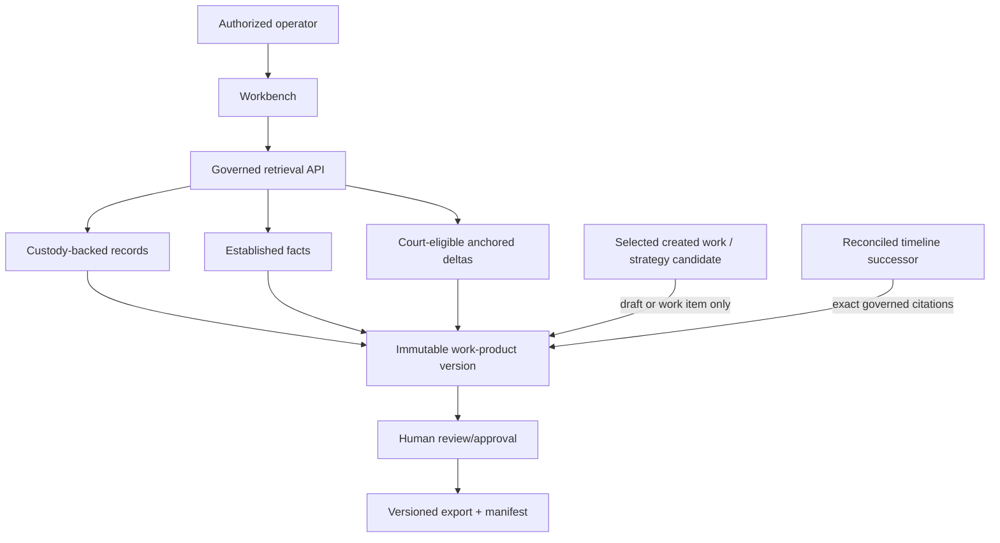

# R12 — Governed Legal Workbench

## Purpose and authority

This lane implements D-069, D-072, D-073, D-082–D-085, ADR-0060, and the related D-069–D-081 rulings for legal analysis and work product. The Workbench may draft from governed, traceable material; it does not establish facts, promote model assertions, or bypass custody. The deployment permanently serves one owner and one personal case. Existing Matter/CourtCase IDs and `case_id='primary'` are compatibility scaffolding only; they do not define a hierarchy, tenant boundary, or authorization to create more scope objects.

Agno/AgentOS is an orchestration/runtime adapter for drafting and review, not a truth authority. Its sessions, memories, tool outputs, and database writes cannot establish facts or become the canonical legal record; canonical custody, governed facts, versions, reviews, and receipts remain in PostgreSQL-controlled domain contracts.

## Scope

In scope: fixed singleton personal-case scoping, compatibility-ID containment, governed retrieval,
work-product/version storage, assertion/citation links, approvals, privilege/access controls, export
manifests, selected created-work materialization, strategy/investigation work-item intake, timeline-to-
legal handoff, and production Workbench behavior.

Out of scope: custody acquisition, extraction, claim/fact adjudication, walk execution, or court filing/service without separate explicit authorization.

## Owned surfaces

- PostgreSQL singleton legal-scope bindings, existing compatibility identifiers, work products, immutable versions, assertions, citations, review events, and export receipts.
- Workbench API authorization and governed retrieval facade.
- Workbench UI source badges, citation resolution, review state, and export gate.
- Audit and operational dashboards for governed drafting.
- Draft/work-item inboxes for attributable selections from created-work versions, strategy candidates,
  investigation concerns/evidence needs and governed timeline review.

## Contracts and cardinalities

- The deployment has one owner and one personal case. Scope is fixed server-side; do not add tenant routing, multi-Matter abstractions, or cross-scope isolation machinery.
- Existing Matter/CourtCase IDs and `case_id='primary'` may be preserved and referenced only for compatibility while current consumers are reconciled. They must not proliferate or become new domain identities.
- There is no Matter-to-CourtCase hierarchy. A work product belongs to the singleton personal case and may carry an existing compatibility ID only when a current schema or consumer requires it.
- Filing, hearing, order, docket, service, and other proceeding metadata attach to the singleton personal case through governed typed relations; they do not require creating a CourtCase row.
- A work-product version has one parent product and zero-or-one prior version; versions are immutable.
- Legal assertions and citations belong to an exact product version.
- Citations use typed foreign-key families for custody evidence, normalized records, established facts, court authorities, and court-eligible delta versions.
- An AI-chat extraction run may emit created-work versions and strategy candidates, but those objects
  retain context-only lineage and enter R12 only through an attributable selection/materialization
  command. The result is a draft product version or work item, never evidence, a fact, a citation or an
  approved strategy.
- A Timesketch candidate or annotation may create an investigation/legal work item. A governed timeline
  entry may inform a draft only through its exact PG fact/assertion and evidence/citation versions;
  a raw Timesketch/OpenSearch row is never a legal citation.
- If a source, approved timeline entry or cited fact changes, R12 receives the governed successor event,
  marks dependent drafts/work items stale, recomputes the source-set hash and requires a new product
  version and review. Approval never floats across amendment reconciliation.

## PostgreSQL events and receipts

- `legal_work_product_event`: created, versioned, submitted, returned, approved, superseded, archived.
- `legal_retrieval_receipt`: scope, user/role, query hash, governed source IDs/versions, disclosure decision, and time.
- `legal_assertion`: exact asserted text/span and status.
- Typed `legal_citation_*` link tables; no authority-sensitive polymorphic ID.
- `legal_review_event`: reviewer, role, decision, comments, source-set hash.
- `legal_export_receipt`: product version, content hash, template/render version, citation manifest hash, requester, approver, destination class, and timestamp.
- `legal_access_event`: append-only grant/deny/read/export audit.
- `legal_materialization_event`: selector/actor, source extraction and created-work version, exact chat
  span/asset lineage, destination product/work item, rationale and idempotency key.
- `legal_work_item_event`: investigation/strategy/timeline-review item created, assigned, blocked,
  superseded or completed; completion does not establish its factual premise.

## Temporal and n8n responsibilities

Temporal owns durable generation jobs, governed-source snapshotting, render activities, approval waits, retries, cancellation, and export-receipt finalization. A retry cannot create an untracked second version or export.

n8n may implement intake forms, assignment, reminders, review routing, and delivery notifications through authenticated Workbench APIs. It cannot query raw evidence stores, establish facts, approve on behalf of a reviewer, or send/file a document without the governed export gate.

## Invariants

1. Every substantive assertion is either cited or visibly marked unsupported/draft and blocked from governed export.
2. AI chats/exports are permanently context-only and never evidence, citations, corroboration, or
   fact support. Extracted created works may enter the Workbench only as linked drafts.
3. Walk beliefs are never cited as facts. Delta is legal-eligible only when version-pinned, reviewed, and anchored to established facts.
4. Source scope, disclosure tier, privilege, and user role are checked before retrieval and again before export.
5. No product or proceeding requires a new Matter/CourtCase object; existing compatibility IDs may be retained only when required by the current schema and cannot determine authorization or create hierarchy.
6. Product versions, citations, reviews, and exports are append-only.
7. A changed source set creates a new version and new review; approval does not float forward.
8. Exported content is reproducible from its immutable version and manifest.
9. Workbench writes never mutate custody, records, claims, facts, walks, or deltas.
10. Owner/personal-case scope is server-controlled; caller-supplied tenant, Matter, or CourtCase switching and compatibility-ID creation are rejected.
11. Agno/AgentOS may invoke governed Workbench commands but cannot write canonical legal or evidence tables through a generic database tool.
12. Created works remain authored artifacts and strategies remain proposals. Selection creates only a
    draft/work item; factual assertions still require independent custody-backed citations and review.
13. Timesketch/OpenSearch rows, curation state and amendment candidates are not legal citations. Only a
    reconciled PG governed successor and its exact established-fact/evidence lineage may enter a source set.
14. A pending/rejected amendment cannot silently alter an approved product. An accepted successor marks
    every dependent draft/product version stale and requires versioning plus re-review before export.

## Implementation phases

1. Freeze product taxonomy, singleton-scope and compatibility-ID rules, citation types, privilege roles, and export states.
2. Add forward PostgreSQL migrations and integrity triggers for scope and typed citations.
3. Implement governed retrieval and remove direct Workbench store access.
4. Implement immutable draft/version/review/export APIs and Temporal workflow.
5. Add UI provenance badges, unsupported-assertion gate, citation resolver, and review diff.
6. Backfill existing documents as legacy versions with explicit provenance completeness state.
7. Shadow exports, conduct legal/governance review, then enable production export by product class.
8. Add typed inboxes and attributable materialization for created works, strategies, evidence needs and
   timeline-derived work; wire successor/staleness events to TODO reassignment and product re-review.

## Current gaps

- Existing generated documents need provenance and scope classification.
- Product classes that are proceeding-specific require a final registry.
- Privilege/redaction policy must be verified end-to-end, including previews and logs.
- Citation drift detection and source revocation behavior require implementation proof.
- External filing or delivery remains outside this lane unless separately authorized.
- The D-083 typed fan-out has no proven production R12 materialization contract separating created-work
  drafts, strategy work items, investigation concerns/evidence needs and observation candidates.
- ADR-0060 successor/amendment events are not proven to invalidate dependent legal drafts, split TODOs
  by semantic domain/agency, or require source-set reconciliation and re-review.

### Audit evidence snapshot — repository versus live (2026-08-26)

| Surface | Repository evidence | Live/read-only evidence | Status and gap |
|---|---|---|---|
| Deployment lineage | `deploy/workbench.yaml:7-9` explicitly deploys the Workbench from `workbench/sprint` until milestone completion and scopes Watch Paths to `workbench/**` plus `deploy/workbench.yaml`. | Coolify reported `knowledge-workbench` `running:healthy`, branch `workbench/sprint`, last finished deployment commit `1e38d3a61d86fe5bd4d94a549b7797380f8faa1c` on 2026-08-18. | **Partial:** branch/path parity is coherent, but the live revision is old and no current UI/API acceptance run was attached. |
| Governed backend | This guide requires governed retrieval and typed immutable citations. AgentOS registration is visible at `server/api/main.py:424-459`. | AgentOS root returned 200, but protected-route bearer behavior, singleton owner/case enforcement, and Workbench-to-AgentOS authenticated calls were not tested. Exec-tier is `RUNTIME_ENV=dev` and still connects as PG superuser `ai`. | **High security/authority gap:** UI health does not prove governed retrieval or least privilege. |
| Direct graph access | `workbench/api/app/repo/graphiti_client.py:76-85` calls Graphiti without authorization; direct Graphiti ports are published by `deploy/data-graphiti.yaml:99-118` and `deploy/data-graphiti-case.yaml:86-97`. | Graphiti remains configured and both applications are running. | **High bypass drift:** Workbench can avoid the governed retrieval/receipt boundary; disable this path before legal acceptance. |
| Legal controls | Repository tests/files inspected in this lane do not constitute a production export, privilege, revocation, or citation-resolution run. | No live singleton-scope governed product, blocked unsupported export, access event, immutable export receipt, or reproduction hash was observed. | **Stop:** R12 remains unaccepted. |
| Agno tool authority | `server/agents/providers.py:147-158` creates a write-capable generic database provider and `:192` places it in the shared agent tool bundle. | Exec-tier runs as PG superuser `ai`; no live policy test proved that agents cannot modify canonical legal/evidence state. | **Critical authority drift:** drafting/runtime agents can potentially bypass typed citations, review, and export receipts. |
| AI-chat evidence promotion | `workbench/api/app/service/detect.py:1-16` classifies chat exports; `workbench/api/app/service/promote.py:1-15,112-143` sends them to `/v1/evidence/import` with `workflow=chat-transcript`; the runtime exposes individual and bulk promote endpoints. | The audited `knowledge-workbench` deployment was running/healthy from `workbench/sprint`; no live negative run proved these paths disabled or remapped. | **Critical live/product violation (GAP-023/GAP-032):** D-082 permanently forbids AI-chat promotion. Disable/remap this surface to context ingest plus typed extraction before any R12 acceptance. |

### Audit gap backlinks

R12 owns or shares the following open findings in the [audit gap register](../AUDIT-GAP-REGISTER.md):
[GAP-011](../AUDIT-GAP-REGISTER.md), [GAP-013](../AUDIT-GAP-REGISTER.md),
[GAP-019](../AUDIT-GAP-REGISTER.md), [GAP-021](../AUDIT-GAP-REGISTER.md),
[GAP-022](../AUDIT-GAP-REGISTER.md), [GAP-023](../AUDIT-GAP-REGISTER.md),
[GAP-028](../AUDIT-GAP-REGISTER.md), [GAP-030](../AUDIT-GAP-REGISTER.md),
[GAP-032](../AUDIT-GAP-REGISTER.md), [GAP-033](../AUDIT-GAP-REGISTER.md), and
[GAP-034](../AUDIT-GAP-REGISTER.md).
Their register acceptance gates are mandatory lane handoff conditions; this guide does not claim
they are implemented.

## Test matrix

| Test | Required result |
|---|---|
| Singleton-scope memo or proceeding product | Allowed without creating Matter/CourtCase rows |
| New Matter/CourtCase creation | Rejected at database/API boundary |
| Compatibility ID used as hierarchy or scope selector | Rejected |
| Alternate owner/case scope | Rejected; no multi-tenant routing |
| Unsupported assertion | Visible in draft; governed export blocked |
| AI assertion as sole fact | Fact citation/export rejected |
| Unanchored delta | Legal citation rejected |
| Source changed after approval | New review/version required |
| Unauthorized/privileged source | Excluded and access event recorded |
| Duplicate export retry | Same receipt/artifact, no second uncontrolled delivery |
| Missing/invalid AgentOS bearer | Workbench request denied; no source metadata leaks |
| Direct store access from Workbench | Denied at network/role/API boundary |
| Direct Graphiti client | Disabled or denied; governed API receipt is required for every graph-derived result |
| Preview/log inspection | Privileged content, credentials, and evidence bodies are absent or policy-redacted |
| Deployed branch/revision mismatch | Acceptance stops until branch, SHA, and rendered manifest reconcile |
| AI-chat promote/promote-all | Rejected as evidence promotion; context ingest/extraction proceeds with zero custody/evidence writes |
| Created-work selection | Exact version/span/asset lineage creates an immutable draft only; no fact/evidence/citation authority gained |
| Strategy candidate selection | Creates attributable work item/draft plan only; review state remains proposed |
| Raw Timesketch citation | Rejected; exact reconciled PG fact/evidence versions required |
| Pending approved-entry amendment | Existing approved product remains bound to old immutable source; dependency is visibly stale/pending, never silently changed |
| Accepted timeline successor | Dependent TODOs/products are split/routed by semantic domain or responsible agency, source-set hash changes, and new review/version is required |

## Live acceptance

- In production, create one memo and one proceeding-specific document within the fixed singleton personal-case scope without creating Matter/CourtCase rows.
- Prove alternate-scope selection, compatibility-ID creation, and hierarchy assumptions fail closed.
- Draft from custody evidence, established facts, and an anchored delta; verify every citation resolves to exact immutable versions.
- Attempt export with unsupported text, revoked access, an AI-only assertion, and an unanchored delta; all must be blocked.
- Approve and export a governed version; reproduce its content and manifest hash.
- Record deployment revision, product/version IDs, review/export receipts, access logs, and rollback owner.
- Select one AI-chat-created work and one strategy candidate into R12; prove they become only an
  immutable draft and work item, retain exact context lineage, and cannot satisfy a factual citation.
- Round-trip a bulk timeline curation batch containing an approved-entry amendment; prove R12 receives
  only the reconciled successor event, reclassifies/splits affected handoffs and TODOs by semantic
  domain/responsible agency, and blocks export until the new source set is reviewed.
- Exercise live Workbench chat-export promote and promote-all paths; prove `/v1/evidence/import` is not
  called and no custody/evidence row or event is created.

### Stop and acceptance gates

- **STOP-R12-1:** a healthy Workbench container or rendered draft is not proof of governed legal use.
- **STOP-R12-2:** do not enable governed export while AgentOS authentication, singleton scope, least-privilege DB identity, direct-store denial, privilege/redaction, and citation resolution remain unproved live.
- **STOP-R12-3:** external filing, service, messaging, or delivery remains disabled absent separate explicit owner authorization.
- **STOP-R12-4:** do not enable governed drafting/export until generic Agno database writes are removed or technically denied and all mutations pass through authenticated Workbench domain commands with PG receipts.
- **STOP-R12-5:** stop if AI-chat input can reach evidence import/custody; a created work, strategy or
  Timesketch row can masquerade as a fact/citation; or an accepted timeline successor does not stale
  dependent products and trigger re-review.
- **ACCEPT-R12:** require the two production product classes, negative scope/authority/export tests, exact typed citation resolution, immutable review/export receipts, artifact/manifest reproduction, current branch/SHA parity, access-log review, and rollback drill.

## Migration and rollback

Use expand/backfill/shadow/export-gate cutover. Legacy documents remain immutable and are labeled by provenance completeness; do not silently bless them. Rollback disables new export classes and routes drafting to the last approved surface while retaining all new versions and audit rows. Files later retired move to `to_be_deleted`; nothing is permanently deleted.

## Risks

- Authority laundering through fluent generated prose.
- Authority laundering through an AI-chat created work, strategy proposal or Timesketch display row.
- Privileged material crossing matter/user boundaries.
- Citation drift after source or product changes.
- n8n or UI paths bypassing approval/export controls.
- Treating an analytical belief or delta as adjudicated truth.

## Agent instructions

Read project canon, D-069–D-085, ADR-0060, legal/custody ADRs, and closest `AGENTS.md`. Verify current API/ORM behavior before changes. Keep external filing and messaging disabled unless explicitly authorized. Route created works and strategies only to draft/work-item commands, and split successor-driven handoffs/TODOs by semantic domain or responsible agency without confusing assignment with factual approval. Use forward reversible migrations, typed FKs, least privilege, and live integration tests. Never delete.

## Exact handoff checklist

- [ ] Singleton owner/personal-case scope is implemented; Matter/CourtCase compatibility IDs do not proliferate or form a hierarchy.
- [ ] Governed retrieval is the only Workbench evidence path.
- [ ] Typed citations resolve to immutable governed versions.
- [ ] Unsupported, AI-only, belief-only, and unanchored-delta gates pass live.
- [ ] Privilege, disclosure, revocation, alternate-scope, and compatibility-ID rejection tests pass live.
- [ ] Versioning, review, rendering, and export receipts are idempotent.
- [ ] UI shows source class, authority class, version, and review status.
- [ ] Temporal workflow and n8n business routing boundaries are verified.
- [ ] Production artifact/manifest reproduction succeeds.
- [ ] Rollback, alerts, runbooks, and no-deletion confirmation are attached.
- [ ] AI-chat promote and promote-all paths are denied/remapped to context extraction; zero evidence/custody writes are proven live.
- [ ] Created-work and strategy selections create attributable immutable drafts/work items only.
- [ ] Raw Timesketch rows and pending amendments cannot satisfy legal citations.
- [ ] Reconciled timeline successors stale dependent products, change source-set hashes and force re-review.
- [ ] Successor-driven handoffs/TODOs are semantically split and routed to named domain/agency owners with immutable linkage.
