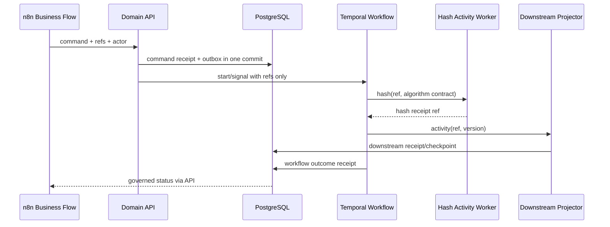

# R13 — Temporal and n8n Execution Boundary

## Purpose and authority

This lane operationalizes D-077/D-078 and D-084/D-085 within the D-069–D-085 authority model. Temporal owns durable sequencing, retries, timers, signals, and execution history. n8n owns business-visible coordination. Hashing is a separate Temporal Activity family. Workflow payloads carry references, not evidence bodies. PostgreSQL CDC/outbox is universal, and downstream receipts return to PostgreSQL. Timesketch bulk curation and approved-entry amendment re-review use the same reference-only, receipt-backed discipline.

Agno/AgentOS is an orchestration/runtime adapter and command consumer only. It does not own truth, and neither Agno session state nor generic agent database/tool output may substitute for PostgreSQL custody, evidence, governed domain writes, outbox events, or receipts.

## Scope

In scope: workflow/activity boundaries, reference payload contracts, idempotency, outbox dispatch, receipts, human tasks, retry/terminal taxonomies, observability, cutover, and recovery.

Out of scope: choosing factual authority, direct evidence transformation in workflow history, n8n-owned durable state, or replacing domain APIs with orchestration internals.

## Owned surfaces

- Temporal namespaces, task queues, workflows, activities, schedules, signals, and worker deployment.
- Separate hashing activity family and restricted worker identity.
- n8n business workflows, forms, assignments, approvals, notifications, and API credentials.
- PostgreSQL command, outbox, receipt, checkpoint, and reconciliation contracts.
- Shared correlation, idempotency, error classification, and operational dashboards.

## Upstream and downstream contracts

Upstream callers submit a small command containing `command_id`, `correlation_id`, authorized PostgreSQL object references/versions, requested operation, policy version, and actor context. Evidence bytes, message bodies, normalized payloads, secrets, and large model traces are prohibited from Temporal/n8n payloads and histories.

Activities dereference through authenticated domain APIs or read models, validate immutable versions/hashes, perform one bounded side effect, and return a compact receipt reference. Domain commits write transactional outbox events. Every downstream consumer records its receipt back in PostgreSQL; Surreal consumes only PG-authorized reconciled manifests.

Timesketch curation orchestration carries only batch/item and exact target-version references. Temporal
may coordinate large strict-atomic/partial batches and amendment re-review; n8n may route human review.
Neither may treat fork-local OpenSearch state as accepted, update an approved entry, or bypass the
context amendment-candidate and successor workflow.

## PostgreSQL events and receipts

- `command_receipt`: unique idempotency key, actor, requested operation, policy version, accepted/rejected state.
- `domain_outbox_event`: append-only, transactionally committed aggregate event with immutable references and payload hash.
- `workflow_execution_receipt`: workflow/run IDs, definition/build IDs, input-reference hash, outcome, and terminal classification.
- `activity_receipt`: activity kind/version, referenced inputs, attempt, result-reference hash, and side-effect identity.
- `hash_receipt`: algorithm/tag, input object/version, H1/H2/H3 result, worker/build identity, and verification state.
- `downstream_receipt`: unique consumer/version/event, applied hash, target identity, and checkpoint.
- `human_task_event`: assigned, claimed, completed, expired, escalated, or cancelled.
- `reconciliation_run` and `reconciliation_mismatch`: authoritative event-to-receipt completeness.

## Temporal and n8n ownership

Temporal owns long-running state, deterministic sequence, retry/backoff, timeout, cancellation, compensation, pause/resume, child workflows, and immutable execution history. Hashing runs only in the separate activity family so algorithm/tag changes, resource limits, and credentials are independently controlled.

n8n owns business-facing forms, routing, reminders, notifications, and human coordination. It calls authenticated APIs and displays returned state. It must not pollute Temporal history with content, execute custody hashes, write databases directly, advance checkpoints, or infer success from HTTP acceptance alone.

## Invariants

1. PostgreSQL is the authoritative command/event/receipt ledger.
2. Every externally visible side effect has a PostgreSQL receipt and stable idempotency key.
3. Workflow/activity payloads are reference-only and size bounded.
4. Hash activity tags identify the exact construction; platform H3 uses `h3-chain-h1genesis-hexconcat-v1` and SBV chain results remain separate import receipts.
5. Retryable, non-retryable, terminal-integrity, and human-action-required failures are distinct.
6. Temporal replay does not repeat an already receipted side effect.
7. n8n cannot be the only holder of state needed for recovery or audit.
8. Surreal receives only reconciled PG-authorized manifests, never raw CDC assumptions.
9. Secrets and evidence content do not enter workflow histories or n8n execution logs.
10. Every Timesketch bulk item has one terminal itemized receipt; whole-batch success cannot conceal
    rejected/conflict/no-op items.
11. An approved-entry edit pauses at a context amendment candidate until attributable re-review and
    reconciliation; only a governed successor may change the active projected version.
10. Agno/AgentOS submits authenticated reference commands and consumes status; it cannot perform canonical writes outside the governed API/activity and PG receipt boundary.

## Current gaps

- Current n8n workflows need direct-DB/body-payload inventory.
- Activity idempotency and receipt coverage must be proven per side effect.
- Temporal build/versioning and worker compatibility policy needs confirmation.
- H3 hashing activity must reconcile provisional normalized H2, promotion verification, and later append-only reverification.
- CDC/outbox coverage and downstream receipt SLAs require a complete registry.

### Audit evidence snapshot — repository versus live (2026-08-26)

| Surface | Repository evidence | Live/read-only evidence | Status and gap |
|---|---|---|---|
| Temporal server/UI | `deploy/temporal/compose.temporal.yaml:1-38` defines separate server/UI services backed by the existing PG instance; the worker is intentionally separate. | Temporal UI `http://100.91.190.107:8233/` returned 200. Coolify reported the stack `running:unknown`; its last finished deployment was commit `16022e93d191ef1d14b21a768d4e8d9d9a103862` on 2026-08-24. | **Partial:** reachability only; namespace retention, persistence schemas, gRPC workflow execution, and recovery were not reverified. |
| Worker | `server/temporal/worker.py:47-74` registers `ChatTranscriptIngest`, `P0DurabilityProbe`, `ClassificationBatchPipeline`, and five activities on `evidence-pipeline`. `docker/temporal-worker/Dockerfile:26-29` still incorrectly says the module is unwritten; `:36-38` installs `temporalio` separately without a pin. | Coolify reported worker `running:unknown`, last finished deployment `4fc3b9d1f984a5603544c3a9c026d5bdbd7aa15b` on 2026-08-25. | **Medium/high reliability gap:** no current boot log, queue poller, build-ID policy, replay, or crash recovery proof. |
| Temporal tests | `tests/test_temporal_skeleton.py:1-17` explicitly runs with no Temporal server, worker, or database. | No live `P0DurabilityProbe` was executed during this audit. | **Stop:** structural tests cannot establish durable execution. |
| API receipt recovery | `/v1/ingest` reserves a durable receipt but dispatches only an in-process `asyncio` task (`server/api/ingest_routes.py:85-109,113-159`); no startup recovery consumer was found. | No crash-after-202 recovery test was observed. | **High reliability gap:** accepted work can remain falsely `running` after process loss. |
| Retry budget | Temporal's store activity retries four times (`server/temporal/workflows.py:111-116,256-267`) while the invoked store path can retry internally four times (`server/evidence/store.py:85-89,206-225,441-474`). | No live attempt-budget/failure-injection trace was captured. | **High reliability/load risk:** one logical operation can reach sixteen DB transactions and obscure the real attempt count. |
| n8n | The import and smoke procedure is explicit at `docs/runbooks/N8N-PIPELINE-GOLIVE-RUNBOOK.md:40-81`; `docs/research/integration-audit-2026-08-24/lane-6-n8n-instance.md:67-83` recorded the greenfield state. | Health returned 200; authenticated API returned exactly zero workflows on 2026-08-26. | **High implementation gap:** no composed workflow is imported/active and the first batch has not run. |
| PG execution identity | `deploy/exec.yaml:80-88` defaults the app to `ai`; `sql/0029_pass_grants.sql` defines the restricted-role grant surface. | PG 18.1 confirms `ai` is superuser and `agno_app` is non-superuser with tested schema/table grants, but current exec env is `DB_USER=ai`. | **Critical least-privilege drift:** the 2026-08-24 handoff claim that exec runs as `agno_app` is not current. |
| Deployment triggers | Canon requires scoped Watch Paths at `docs/PROJECT_CANON.md:205-207`. | Temporal paths are current, but exec-tier uses manifest `/deploy/exec.yaml` while watching obsolete `compose.exec.yaml` rather than `deploy/exec.yaml`. | **High deploy risk:** manifest-only exec changes may not redeploy automatically. |
| Agno write boundary | `server/agents/providers.py:147-158` creates a writable generic PG provider; `:192` distributes it to the shared agent tool set. | Exec-tier runs that path as PG superuser `ai`. | **Critical authority/idempotency drift:** a direct tool write can bypass command IDs, Temporal history, outbox, and receipts. Agno must be limited to governed reference commands. |

### Audit gap backlinks

R13 owns or shares the following open findings in the [audit gap register](../AUDIT-GAP-REGISTER.md):
[GAP-002](../AUDIT-GAP-REGISTER.md), [GAP-004](../AUDIT-GAP-REGISTER.md),
[GAP-007](../AUDIT-GAP-REGISTER.md), [GAP-010](../AUDIT-GAP-REGISTER.md),
[GAP-011](../AUDIT-GAP-REGISTER.md), [GAP-012](../AUDIT-GAP-REGISTER.md),
[GAP-016](../AUDIT-GAP-REGISTER.md), [GAP-017](../AUDIT-GAP-REGISTER.md),
[GAP-018](../AUDIT-GAP-REGISTER.md), [GAP-019](../AUDIT-GAP-REGISTER.md),
[GAP-021](../AUDIT-GAP-REGISTER.md), [GAP-024](../AUDIT-GAP-REGISTER.md),
[GAP-025](../AUDIT-GAP-REGISTER.md), [GAP-029](../AUDIT-GAP-REGISTER.md),
[GAP-030](../AUDIT-GAP-REGISTER.md), [GAP-031](../AUDIT-GAP-REGISTER.md), and
[GAP-034](../AUDIT-GAP-REGISTER.md). Their register acceptance gates are mandatory lane handoff
conditions; this guide does not claim they are implemented.

## Implementation phases

1. Inventory workflows, activities, n8n flows, direct writes, payload sizes, and side effects.
2. Publish command/event/receipt schemas, reference envelope, error taxonomy, and idempotency rules.
3. Add transactional outbox/receipt structures to each authoritative PG commit path.
4. Isolate hashing activities and implement D-075/D-076 verification/reverification contracts.
5. Move durable loops/retries/timers from n8n into versioned Temporal workflows.
6. Reduce n8n to authenticated business coordination through domain APIs.
7. Deploy downstream receipt/reconciliation services and enforce Surreal manifest authorization.
8. Shadow, fault-inject, reconcile, and cut over workflow family by workflow family.

## Test matrix

| Test | Required result |
|---|---|
| Duplicate command | Same command/workflow identity; no duplicate side effect |
| Worker crash after side effect | Receipt reconciliation prevents repetition |
| Retryable outage | Backoff/recovery with complete history |
| Terminal hash mismatch | Fail closed; immutable receipt and alert |
| Oversized/body payload | Rejected before workflow start |
| n8n outage | Durable workflow continues; business task recoverable |
| Temporal replay/build upgrade | Deterministic or intentionally version-gated |
| Missing downstream receipt | Checkpoint stalls and reconciliation alerts |
| Secret/log inspection | No secret or evidence body present |
| Live durability probe | Completes through server/worker/PG; history and receipt IDs are captured |
| Worker restart during activity | Same workflow identity resumes; receipted effect is not repeated |
| Crash after HTTP 202/receipt reservation | Startup recovery resumes or terminally reconciles the receipt; it never remains indefinitely running |
| Nested retry failure | Observed attempt count matches one published budget and cannot multiply across layers |
| n8n workflow census | Required four workflows exist, exact expected versions are active, and no unapproved flow is enabled |
| Restricted DB identity | `SET ROLE agno_app` required operations succeed; DDL/role/admin operations fail |
| Deploy parity | Manifest path is watched and last finished SHA equals the approved remote revision |

## Live acceptance

- Run a production workflow from n8n intake through API command, PG outbox, Temporal execution, downstream receipt, and business notification.
- Kill workers before and after a side effect; prove exact-once effect through idempotency and receipts.
- Exercise retryable, terminal-integrity, cancellation, timeout, and human-wait paths.
- Verify platform H3 and separate SBV import receipt with exact algorithm tags.
- Demonstrate that Surreal projection cannot consume an unreconciled manifest.
- Inspect Temporal/n8n histories for reference-only payload compliance and record deployment/build IDs.

### Stop and acceptance gates

- **STOP-R13-1:** zero n8n workflows means the n8n-to-Temporal product path is not deployed; do not infer implementation from JSON composition or service health.
- **STOP-R13-2:** do not run real-corpus workflows while exec-tier uses superuser `ai`, while reference-only payload/log inspection is absent, or before the limit-10 disposable smoke is reviewed and purged.
- **STOP-R13-3:** do not claim durability from `tests/test_temporal_skeleton.py`; require live server/worker/PG execution with crash/restart injection.
- **STOP-R13-4:** do not rely on webhook redeploy until the active manifest and Watch Paths reconcile.
- **STOP-R13-5:** do not certify the execution boundary while any Agno/AgentOS agent can make generic canonical PG writes outside the authenticated command/outbox/receipt path.
- **STOP-R13-6:** do not accept API durability until receipt reservation has deterministic startup recovery and nested store/Temporal retries are collapsed into one observable budget.
- **ACCEPT-R13:** import/activate only the approved flows, execute and review the limit-10 batch, capture Temporal histories and PG receipts, pass crash/retry/cancel/terminal/human-wait tests, prove reference-only histories and secret-safe logs, cut to least privilege, and record current deployment/build IDs plus rollback.

## Migration and rollback

Use per-workflow expand/shadow/cutover flags. During shadowing only one path may perform side effects; the other observes and compares. Rollback disables new starts/signals for the new workflow version and routes new commands to the last approved version; in-flight runs follow the published compatibility policy. Events and receipts remain immutable. Nothing is deleted; retired definitions/files later move to `to_be_deleted`.

## Risks

- Duplicate side effects across retry boundaries.
- Evidence or secrets retained forever in orchestration history.
- n8n becoming a hidden second workflow engine/database.
- Workflow code changes breaking deterministic replay.
- CDC acknowledged without authoritative downstream receipt.
- Hash algorithms conflated across platform and SBV custody chains.

## Agent instructions

Read D-075–D-078, project canon, custody documentation, and closest `AGENTS.md`. Inspect current Temporal SDK and n8n API versions before implementation. Never put evidence bodies in workflow payloads. Never edit applied migrations or delete state. Use live failure injection; a happy-path unit test is not completion.

## Exact handoff checklist

- [ ] Every workflow has an owner, durable/business classification, and side-effect inventory.
- [ ] Reference envelope and payload size limits are enforced.
- [ ] Command, outbox, workflow, activity, hash, and downstream receipts are deployed.
- [ ] Hash activities and platform/SBV chain tags are isolated and test-proven.
- [ ] Temporal retry/timeout/cancel/terminal policies are documented and exercised.
- [ ] n8n uses APIs only and owns no recovery-critical state.
- [ ] Every side effect is idempotent and reconciled in PostgreSQL.
- [ ] Surreal accepts only authorized reconciled manifests.
- [ ] Production fault-injection evidence, dashboards, alerts, and runbooks are attached.
- [ ] Cutover/rollback flags and no-deletion confirmation are recorded.
