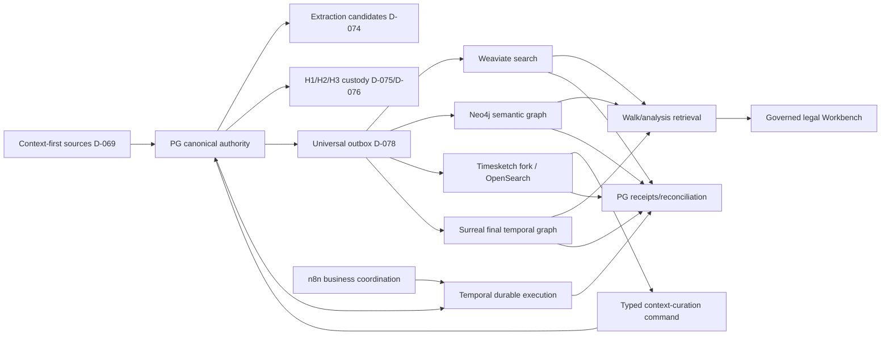

# R14 — Migration, Cutover, and Whole-System Integration

## Purpose and authority

R14 is the integration lane mandated by D-081 for bounded R00–R14 authority workstreams. It turns D-069–D-085, including D-084/D-085 and ADR-0060, into an ordered production transition with measurable gates and rollback. PostgreSQL 18 with pg_duckdb, PostGIS, and pgvector remains canonical; Weaviate is search, Neo4j the rebuildable semantic graph, the maintained Timesketch fork/OpenSearch is the rebuildable personal-case timeline and governed context-curation surface, and Surreal is the rebuildable final governed temporal aggregation for walk/analysis.

Agno/AgentOS is not an authority store in this model. It is strictly an orchestration/runtime adapter that submits governed commands and consumes governed results. Its sessions, memories, knowledge adapters, and generic tools cannot author truth or bypass PostgreSQL custody/evidence/governance contracts.

## Scope

In scope: dependency sequencing, forward migrations, backfills, reconciliations, shadow paths, feature flags, production deployment, live acceptance, rollback, legacy containment, and cross-lane evidence.

Out of scope: redefining domain rulings, deleting old data, silently repairing custody history, or declaring completion from local/unit tests.

## Owned surfaces

- Cross-lane dependency and contract registry.
- Migration/cutover ledger, capability gates, feature flags, reconciliation evidence, and rollback runbooks.
- Production integration suite and acceptance evidence index.
- Legacy/read-only inventory and eventual `to_be_deleted` manifests.

## Upstream and downstream contracts

Each R00–R13 lane hands off: migration IDs, authoritative tables/keys, event and receipt schemas, producer/consumer versions, backfill manifest, reconciliation query/results, live test evidence, metrics/alerts, feature flag, rollback action, and accountable owner.

R14 returns one signed integration manifest containing deployed revisions, schema versions, projection versions, checkpoints, accepted deviations, and go/no-go result. No downstream is authorized merely because its deployment is healthy; its authority contract and receipts must reconcile.

## PostgreSQL events and receipts

- `migration_run` and `migration_step_receipt`: migration/version, environment, checksum, actor, start/end, result.
- `backfill_manifest` and `backfill_partition_receipt`: input bounds, source snapshot/checkpoint, counts, hashes, version.
- `cutover_event`: capability, old/new route, flag version, approver, effective time.
- `integration_acceptance_run` and `integration_assertion_result`: exact tests, evidence references, deviations.
- `rollback_event`: trigger, affected capability, target version, actions, reconciliation state.
- Universal domain outbox and consumer receipts required by D-078.
- `timeline_projection_generation`, member and read-back receipts: immutable PG membership/hash,
  policy/source versions, Timesketch/OpenSearch target identity and reconciliation result.
- `timeline_curation_batch`/`timeline_curation_item` receipts: actor, rationale, idempotency key,
  expected generation/object version, typed operation, before/after hashes, item result and reversal link.
- `timeline_amendment_candidate` plus review/reconciliation receipts: exact approved-entry/fact/evidence
  lineage, unchanged approved hash/version, re-review outcome and governed-successor generation when accepted.
- `legacy_asset_registry`: location, authority status, access mode, replacement, retention/retirement decision.

## Temporal and n8n responsibilities

Temporal owns durable migration/backfill orchestration, partition retry, dependency gates, long waits, reconciliation, cutover sequencing, and rollback workflows. Hashing uses the separate activity family; workflow payloads remain reference-only.

n8n owns change-window requests, stakeholder assignments, approval presentation, reminders, and completion notifications through governed APIs. It never applies migrations, advances checkpoints, edits flags directly, or decides acceptance from UI state.

## Integration invariants

1. Context is captured before later authority stages; extraction creates candidates/provenance/conflict assistance only.
2. Verbatim message participants remain on each message; entity resolution is additive.
3. The deployment is permanently one owner/one personal case. Existing Matter/CourtCase IDs and `case_id='primary'` are compatibility scaffolding only: they do not define a hierarchy, tenant boundary, or permission to create additional scope objects.
4. Provisional normalized H2 is recomputed/verified at promotion; later checks append reverification events.
5. Platform H3 is H1 genesis plus the full ordered normalized-generation H2 hex concatenation tagged `h3-chain-h1genesis-hexconcat-v1`; SBV chain is a separate import receipt.
6. Raw geospatial values and canonical PostGIS geometry are both retained with transformation provenance.
7. PG is authoritative; Weaviate, Neo4j, Timesketch/OpenSearch, and Surreal are versioned and rebuildable.
8. Graphiti is retired and cannot receive new authoritative or belief-state writes.
9. Every downstream event has a PG receipt; Surreal consumes only authorized reconciled manifests.
10. No parallel authored store is introduced during dual-run; only derived projections may shadow.
11. No file, table, row, volume, or legacy export is deleted by an agent.
12. Agno/AgentOS owns no canonical fact, custody, walk, legal, projection, or receipt state; every mutation crosses a governed PG domain-command boundary with least privilege and an auditable receipt.
13. Any supported context family may produce a timeline candidate, including AI chat, without gaining
    evidentiary weight; evidence-approved entries may coexist only with unmistakable authority badges
    and exact governed lineage.
14. Every Timesketch/OpenSearch core event belongs to an immutable, hashed PG projection generation;
    the serving store is disposable and exactly rebuildable from PG.
15. The fork may perform governed individual/bulk curation only through typed, version-bound PG commands
    with itemized receipts; it cannot write canonical PG or projection state directly.
16. Any edit to an evidence-approved/governed entry appends a linked context amendment candidate. The
    approved version remains active and unchanged until independent re-review/reconciliation appends a
    governed successor and a new projection generation.

## Ordered implementation phases

1. **Gate 0 — inventory/freeze:** capture current schemas, row counts, hashes, services, callers, credentials, Graphiti dependencies, and legacy assets.
2. **Gate 1 — contracts:** approve authoritative ownership, IDs, timestamps, event registry, receipt contract, participant payload, geo, and custody algorithm tags.
3. **Gate 2 — PostgreSQL expand:** apply forward migrations for canonical rows, additive resolution, geo, custody verification, outbox, receipts, and workflow ledgers.
4. **Gate 3 — producer adoption:** context-first ingest and Semantica candidate/provenance paths write the new contracts; old paths remain observed, not co-authoritative.
5. **Gate 4 — custody verification:** recompute promotion H2, build platform H3, preserve separate SBV receipts, and reconcile every chain.
6. **Gate 5 — durable execution:** cut workflow families to Temporal and reduce n8n to business coordination.
7. **Gate 6 — derived rebuilds:** deploy the maintained Timesketch fork and rebuild Timesketch/OpenSearch, Weaviate and Neo4j, then Surreal from immutable reconciled PG manifests; cease Graphiti writes.
8. **Gate 7 — timeline curation/walk/legal:** enable governed Timesketch individual/bulk curation after its writer fences and round-trip tests pass; then enable horizon-safe walks, anchored paired deltas, and governed Workbench exports.
9. **Gate 8 — production acceptance:** run whole-system live suite, sign evidence, cut over reads, and monitor soak period.
10. **Gate 9 — legacy containment:** retain old surfaces read-only. Any later retirement moves files to `to_be_deleted` after owner approval; external data follows its approved retention process, never agent deletion.

### Gate 3 sole-writer fence matrix

“Old paths remain observed” is insufficient while they can still author competing state. Before any
new producer is activated, R14 requires an enforcing fence and denial proof for each transition:

| Authority transition | Sole governed writer | Legacy fence required before activation |
|---|---|---|
| Source landing → context | R02 typed command under context-writer role | custody-first API/workflow/Temporal routes disabled for writes; failed-parse test proves zero evidence rows |
| Context → evidence/custody | R04 atomic promotion command under custody role | direct `ingest_artifact()` custody entry and generic agent SQL denied; H1/H2/H3 mismatch fails closed |
| Candidate → governed fact/relation/realization | R07 review command under governance role | Semantica/n8n/agent direct fact writes denied; HITL decision is enum- and item-bound |
| Governed PG → Weaviate/Neo4j/geo | R05/R06/R08 projector identities consuming PG outbox | manual/direct projection writers and Graphiti sinks disabled; every observation returns a PG receipt |
| Immutable PG timeline generation → Timesketch/OpenSearch | versioned timeline projector identity consuming only sealed generation members | fork UI/analyzers/stock importers/generic agents denied core-event and projection-control writes; every member returns a read-back PG receipt |
| Timesketch individual/bulk curation → PG context | authenticated timeline-curation command role appending batches/items and typed context results | fork has no PG table credentials; role denied UPDATE/DELETE on raw context, evidence, custody, fact, approved timeline, generation and receipt rows |
| Approved timeline edit → amendment review | evidence/fact governance command after independent review of exact amendment candidate | direct approved-row mutation and self-approval denied; current approved hash/version remains unchanged until successor append and R09 reconciliation |
| Projection receipts → authorized aggregate manifest | R09 reconciler role | no store-local or mutable-view admission; incomplete/stale/orphan manifests denied |
| R09 manifest → Surreal | R10 projector identity | raw CDC/direct agent/other-store feeds denied; Surreal remains rebuildable and receipted |
| Manifest → walk/belief/delta | R11 governed commands and Temporal workflows | direct store/base-table access and generic agent writes denied; PG lifecycle ledgers mandatory |
| Governed findings → legal output | R12 legal-review/release commands | raw context/candidate/unanchored belief citation and compatibility-ID scope switching denied |

Each fence is implemented with least-privilege roles/grants, typed command boundaries, feature/route
gates, append-only receipts, zero-writer telemetry and live negative tests. Shadow/dual-run paths may
emit comparison receipts only; they cannot become parallel authors.

### Timesketch deployment, rebuild, and rollback gates

- **DEPLOY-R14-TS:** record the maintained-fork repository/branch, upstream base commit, patch-series
  identity, application commit, immutable image digest, migration/config hashes, Coolify resource and
  Watch Paths, Timesketch/OpenSearch/metadata-store versions, authenticated endpoints, distinct
  projector/curation identities, and rollback owner. Stock importers/analyzers and direct OpenSearch
  writes remain disabled until their denial tests pass.
- **REBUILD-R14-TS:** from an empty inactive Timesketch/OpenSearch serving target, import one sealed PG
  `timeline_projection_generation`; reconcile count, ordered membership, content hashes, required
  Timesketch mappings, authority badges, temporal uncertainty, saved governed annotations and source
  links. Fork-local mutable rows are never accepted as rebuild input.
- **ROUNDTRIP-R14-TS:** exercise individual, mixed-validity bulk, strict-atomic, stale/replay and
  compensating edits. Each item must return a PG receipt and reappear only through a later immutable
  projection generation. An approved-entry edit must produce an amendment candidate, retain the exact
  approved hash/version, pass independent review, and append a governed successor before display changes.
- **ROLLBACK-R14-TS:** stop new fork command admission and the affected projector version, preserve every
  PG generation, batch/item, amendment, approval/successor and receipt, restore the prior approved fork
  image plus alias/reader/generation binding, and reconcile it. Rollback never copies fork/OpenSearch
  state into PG, rewrites approved history, or deletes a failed generation.

## Current gaps

- R00–R13 handoff completeness and exact deployed schema inventory need reconciliation.
- Graphiti callers and state requiring preservation must be enumerated.
- Existing H2/H3 generations require algorithm-tag audit before any backfill.
- All direct database writers and downstream consumers need ownership mapping.
- Production acceptance thresholds, soak duration, and named rollback authority require sign-off.
- D-084/D-085 and ADR-0060 are accepted design, but the dated 2026-08-26 audit did not prove a deployed
  maintained fork, immutable PG generation/curation writers, direct-write denials, amendment re-review,
  clean rebuild, or live rollback. No Timesketch capability is accepted from the decision alone.

### Audit evidence snapshot — repository versus live (2026-08-26)

| Domain | Repository evidence | Live/read-only evidence | Integration result |
|---|---|---|---|
| Deployment plane | Canon requires git-push deployment with per-app Watch Paths (`docs/PROJECT_CANON.md:205-207`); tracked manifests now live under `deploy/`. | Many applications point at `/deploy/*.yaml` but still watch obsolete root `compose.*` paths. All app configs use `git_commit_sha=HEAD`; actual deployment history ranges from 2026-08-05 to 2026-08-25. Local HEAD `4dff58a25aca2c77d8e0057f2d6f8b86338d5e6f` is ahead of origin/main and live exec `4fc3b9d1f984a5603544c3a9c026d5bdbd7aa15b`. | **STOP/high:** there is no fleet-wide immutable SHA/rendered-manifest parity proof. |
| Canonical PG | `deploy/data-pg.yaml:40-48` defines the PG service; the schema/migrations define canonical domains and restricted-role grants. | PG 18.1, pg_duckdb 1.1.0, PostGIS 3.6.4, and vector 0.8.6 were live. `agno_app` grants tested true, but exec still uses superuser `ai`; RLS was enabled on 0 of 143 inspected evidence/working/analysis base tables. | **STOP/critical:** least-privilege cutover is false; RLS is an explicit design/acceptance question, not presumed complete. |
| Weaviate | `deploy/data-weaviate-native-v1.yaml:1-27` defines the side-by-side native target; `server/core/native_evidence_runtime.py:131-134` is fail-closed. | Old 8081 and native 8082 were both ready at v1.38.7; live activation value is an instruction string and therefore false. | **Partial:** substrate exists; native projection/canaries/reconciliation/cutover do not. |
| Neo4j/Graphiti | Canon retires Graphiti; `server/agents/providers.py:194-212` still conditionally attaches it. | Neo4j HTTP root returned 200. Graphiti URL is live and both Graphiti apps remain running. | **STOP/high:** authenticated Neo4j reconciliation and Graphiti zero-write/zero-caller proof are missing. |
| Surreal/walks | `sql/0027_walk_ledger.sql:85-399` provides current PG walk/checkpoint/delta structures; `deploy/compose.surreal-phase1.yaml:1-48` is an isolated synthetic target. | Walk tables exist; Phase-1 Surreal is healthy; old legacy URL timed out; no production Surreal projection or live paired walk was evidenced. | **STOP:** R10/R11 are schema/scaffold states, not accepted capabilities. |
| Temporal/n8n | Worker registration is at `server/temporal/worker.py:47-74`; n8n go-live steps are `docs/runbooks/N8N-PIPELINE-GOLIVE-RUNBOOK.md:40-94`. | Temporal UI and n8n health returned 200; n8n workflow count is zero; no live durability probe or classification smoke ran. | **STOP/high:** R13 is not end-to-end deployed. |
| Receipt/retry reliability | `/v1/ingest` pairs a durable receipt with an in-process task and no discovered startup recovery (`server/api/ingest_routes.py:85-109,113-159`). Temporal and store retry loops can multiply to sixteen DB transactions (`server/temporal/workflows.py:111-116,256-267`; `server/evidence/store.py:85-89,206-225,441-474`). | No crash-after-acceptance or bounded-attempt production trace was supplied. | **STOP/high:** acknowledgement is not durable completion and attempt semantics are not controlled. |
| AgentOS/Workbench | AgentOS configuration is `server/api/main.py:424-459`; Workbench deployment contract is `deploy/workbench.yaml:7-9`. | AgentOS root 200; protected auth was not tested. Exec is `RUNTIME_ENV=dev`. Workbench is healthy on `workbench/sprint`, last deployed 2026-08-18. | **STOP/high:** healthy front ends do not prove governed authorization/export. |
| Agno authority drift | `server/agents/providers.py:147-158` builds a writable generic PG provider; `:192` distributes its tools uniformly, and `server/agents/factory.py:157-165` passes shared tools to an orchestrator. | The runtime currently connects as PG superuser `ai`. | **STOP/critical:** Agno has a path to write the canonical store outside governed domain commands, contradicting its execution-only role. |
| Test coverage | Root `AGENTS.md` requires `uv run pytest -m integration` before “done.” | Marker census found two integration-marked files: `tests/integration/test_ingest_scratch_live.py` (live/opt-in) and `tests/test_schema_docs_current.py` (documentation structure); no service-specific live suite was executed in this read-only audit. | **STOP:** R14 cannot pass from unit/structural tests. |

### Audit gap backlinks

R14 owns or shares the following open findings in the [audit gap register](../AUDIT-GAP-REGISTER.md):

- Critical: [GAP-001](../AUDIT-GAP-REGISTER.md), [GAP-003](../AUDIT-GAP-REGISTER.md),
  [GAP-004](../AUDIT-GAP-REGISTER.md), [GAP-006](../AUDIT-GAP-REGISTER.md),
  [GAP-008](../AUDIT-GAP-REGISTER.md), [GAP-009](../AUDIT-GAP-REGISTER.md),
  [GAP-010](../AUDIT-GAP-REGISTER.md), [GAP-011](../AUDIT-GAP-REGISTER.md),
  [GAP-012](../AUDIT-GAP-REGISTER.md), and [GAP-032](../AUDIT-GAP-REGISTER.md).
- High: [GAP-013](../AUDIT-GAP-REGISTER.md), [GAP-014](../AUDIT-GAP-REGISTER.md),
  [GAP-015](../AUDIT-GAP-REGISTER.md), [GAP-016](../AUDIT-GAP-REGISTER.md),
  [GAP-017](../AUDIT-GAP-REGISTER.md), [GAP-018](../AUDIT-GAP-REGISTER.md),
  [GAP-019](../AUDIT-GAP-REGISTER.md), [GAP-020](../AUDIT-GAP-REGISTER.md),
  [GAP-021](../AUDIT-GAP-REGISTER.md), [GAP-023](../AUDIT-GAP-REGISTER.md),
  [GAP-024](../AUDIT-GAP-REGISTER.md), [GAP-026](../AUDIT-GAP-REGISTER.md),
  [GAP-027](../AUDIT-GAP-REGISTER.md), [GAP-031](../AUDIT-GAP-REGISTER.md), and
  [GAP-034](../AUDIT-GAP-REGISTER.md).
- Medium/high: [GAP-028](../AUDIT-GAP-REGISTER.md).

The register acceptance gates are mandatory R14 inputs; this guide does not claim any finding is
implemented or closed.

## Test and gate matrix

| Gate | Required proof |
|---|---|
| Context/extraction | Context precedes promotion; Semantica cannot establish facts |
| Participants | Verbatim payload unchanged; resolution adds links only |
| Custody | H1/H2/H3 vectors and reverify events match exact tags |
| Geo | Raw value retained; geometry/SRID/provenance validated |
| CDC | Every event consumed once logically and receipted in PG |
| Search/graphs | Full rebuild equals incremental manifests/counts/hashes |
| Horizon | No future leakage in SQL, vector, Neo4j, or Surreal traversal |
| Execution | Crash/retry/cancel/replay cause no duplicate side effects |
| Legal | Unsupported/unanchored/unauthorized export fails closed |
| Rollback | Route reversal works while authoritative writes remain available |
| Deploy parity | Branch, immutable SHA, manifest location, Watch Paths, rendered hash, and active resource identity all reconcile |
| Least privilege/auth | Production uses restricted roles; protected APIs deny missing/invalid credentials and audit authorized access |
| Runtime configuration | Production does not run with development flags; secrets/credentials are unique, current, and not logged |
| Live-suite coverage | Every R00-R13 lane has a production test, receipt/evidence pointer, owner, and last-verified timestamp |
| Receipt recovery/retry budget | Crash after acceptance is recovered/reconciled; one published retry budget matches observed attempts |
| Timeline source/authority | Every supported context family projects candidates as context-only; evidence-approved entries retain distinct badges and exact citations |
| Timeline generation | PG generation/member rows are immutable; Timesketch/OpenSearch count, membership, content and required-field mappings reconcile |
| Timeline projection fence | Only projector identity writes core events; UI/analyzer/importer/generic-agent direct OpenSearch writes fail |
| Timeline curation fence | Fork identity has no PG table writes; typed command role appends only allowed batch/item/context rows |
| Timeline individual/bulk edit | Itemized accepted/rejected/conflict/no-op receipts are exact; strict mode is atomic and replay idempotent |
| Approved timeline edit | Linked amendment candidate is appended; approved row/hash/version remains unchanged until independently reviewed successor |
| Timeline deployment | Fork/upstream commits, image digest, Coolify revision/Watch Paths, dependency versions and identities reconcile |
| Timeline clean rebuild | Empty target reproduces active PG generation, authority badges, governed annotations and source links exactly |
| Timeline rollback | Prior image/generation reader route restores while all PG edit/review/receipt history remains unchanged |

## Live acceptance

- Ingest one representative source through context, provisional normalization, promotion verification, custody chain, normalized record, claim candidate, and established-fact governance.
- Include all three message families, verbatim participants, additive resolution, and raw/canonical geospatial data.
- Verify universal outbox/PG receipts through Weaviate, Neo4j, Surreal, and Temporal.
- Run paired walks with planted future leakage traps and produce an anchored delta.
- Create and export a governed legal product in the fixed singleton personal-case scope without proliferating Matter/CourtCase compatibility rows.
- Rebuild each derived store from a pinned PG manifest and reconcile.
- Deploy the pinned maintained Timesketch fork and project candidates from every supported context family
  alongside evidence-approved entries; reconcile authority badges, temporal uncertainty and exact source
  opening through immutable PG generation/read-back receipts.
- Prove UI/analyzer/importer/generic-agent direct writes fail. Run individual and mixed/atomic bulk
  curation; verify itemized PG receipts, stale/replay denial, compensating history, and projection only
  from accepted PG outcomes.
- Attempt to edit an evidence-approved entry; prove its row/hash/version remains unchanged, a linked
  amendment candidate is independently reviewed, and only an appended governed successor appears in a
  new reconciled generation.
- Rebuild Timesketch/OpenSearch from an empty target and perform the recorded prior-image/generation
  rollback without losing or mutating any PG curation, amendment, approved or receipt history.
- Execute a controlled rollback drill and attach timings, commands/API operations, receipts, dashboards, and owners.

### Stop and acceptance gates

- **STOP-R14-1 — parity:** any application with an obsolete Watch Path, symbolic `HEAD` without matched deployment-history SHA, stale branch, duplicate active resource, or unmatched rendered manifest blocks fleet acceptance.
- **STOP-R14-2 — authority/security:** exec-tier superuser use, unverified AgentOS bearer enforcement, `RUNTIME_ENV=dev`, direct agent/store paths, or Graphiti write capability blocks cutover.
- **STOP-R14-2A — Agno boundary:** no R00-R14 acceptance while Agno/AgentOS retains generic write access to canonical PG or any derived authority-sensitive store; enforce command-only access, least privilege, and PG receipts first.
- **STOP-R14-3 — completeness:** service health, schema presence, composed workflow files, and unit/contract tests are supporting evidence only; none substitutes for live receipts and reconciliations.
- **STOP-R14-4 — derived stores:** do not enable native Weaviate, Neo4j/Surreal read cutover, or walks until PG manifests, receipts, counts/hashes, horizon traps, rebuilds, and rollback all pass.
- **STOP-R14-5 — orchestration/legal:** n8n count zero, absent Temporal crash/replay proof, or absent governed Workbench export proof blocks whole-system acceptance.
- **STOP-R14-6 — recovery:** an accepted receipt backed only by process-local execution, or multiplicative retry loops without one observable budget, blocks production acceptance.
- **STOP-R14-7 — Timesketch authority:** do not activate the fork while any projected row lacks immutable PG generation/source/authority bindings; while UI/analyzer/importer/generic-agent direct writes succeed; while the fork can write PG tables; or while context-only candidates can appear evidence-approved.
- **STOP-R14-8 — Timesketch edits:** do not enable curation unless every item is version-bound and receipted, mixed/atomic semantics fail closed, accepted results return only through PG outbox projection, and every approved-entry edit becomes an independently reviewed amendment candidate without mutating approved state.
- **STOP-R14-9 — Timesketch operations:** do not accept deployment without a pinned maintained-fork/upstream/image/Coolify identity, empty-target rebuild parity, observed prior-generation rollback and preserved PG edit/review history.
- **ACCEPT-R14:** run the mandatory live integration suite and the complete representative-source journey; reconcile every derived store and receipt; prove authentication/least privilege and secret-safe histories; demonstrate Timesketch any-context/evidence-approved visibility, immutable generations, writer denials, individual/bulk edit round-trip, approved-entry amendment re-review, clean rebuild and rollback; demonstrate paired-walk leakage traps, governed export, failure injection, cutover and rollback; record branch/SHA/config hashes, store/schema/projection versions, timestamps, deviations, owners, soak results, and no-deletion confirmation.

## Migration and rollback

All schema changes are forward, reversible migrations; applied migrations are never edited. Use expand/backfill/reconcile/shadow/cutover/contract. “Contract” means disabling or making old surfaces read-only, not deleting them. Timesketch expands through new immutable PG generation/curation tables and an inactive fork/OpenSearch target; backfill seals a generation before projection, reconciliation precedes reader or edit activation, and shadow mode emits comparison receipts without accepting fork-local authorship. Rollback operates per capability flag and restores the last approved fork image/generation/reader and other reader/worker bindings while preserving new authoritative rows, curation batches/items, amendment candidates, approved successors and receipts. Custody and approved timeline/fact history are never recomputed or mutated in place. Derived stores are rebuilt under new versions after defects.

## Risks

- Cross-lane contract drift hidden by independently passing tests.
- An old writer continuing after cutover and creating split authority.
- Graphiti remaining a hidden dependency.
- Custody chain corruption through algorithm conflation.
- Projection health mistaken for reconciliation.
- Rollback rehearsed locally but unusable in production.
- Timesketch/OpenSearch UI or analyzer state becoming an unreceipted parallel author.
- Bulk-edit partial success being presented as total success or mutating approved history.
- Fork upgrade drift breaking deterministic member mapping or source-opening links.

## Agent instructions

Read all R00–R14 guides, D-069–D-085, project canon, decision log, relevant ADRs including ADR-0060, and closest `AGENTS.md`. Confirm lane ownership before editing. Use forward migrations and production-grade live tests. Record exact versions and evidence. Never delete or use destructive reset/truncate/drop operations; place filesystem retirement candidates in `to_be_deleted` only after owner direction.

## Exact handoff checklist

- [ ] R00–R13 handoffs are present, reviewed, and linked from the integration manifest.
- [ ] Authoritative writer and read/projection owner are named for every table/store.
- [ ] D-069–D-085 invariants are each tied to a deployed constraint and live test.
- [ ] Applied migration checksums and forward/down procedures are verified.
- [ ] Backfill bounds, counts, hashes, mismatches, and approvals are attached.
- [ ] Every downstream consumer returns a reconciled PostgreSQL receipt.
- [ ] Graphiti new writes/callers are zero and legacy state is retained read-only.
- [ ] Weaviate, Neo4j, Timesketch/OpenSearch, and Surreal rebuilds reconcile from PG manifests.
- [ ] Maintained Timesketch fork/upstream commit, image digest, Coolify revision/Watch Paths, dependency versions and distinct identities are pinned.
- [ ] Timesketch/OpenSearch is rebuilt from an immutable PG generation and reconciles membership/content, badges, annotations and source links.
- [ ] Projector-only OpenSearch writes and typed-command-only PG curation pass live direct-write denial tests.
- [ ] Any-context candidates and evidence-approved entries coexist without authority laundering.
- [ ] Individual, mixed/atomic bulk, stale/replay and compensating edit batches return exact item receipts.
- [ ] Approved-entry edit creates a linked amendment candidate; unchanged approved hash/version and independently reviewed successor are proved.
- [ ] Prior fork image/generation rollback preserves every PG generation, edit, amendment, approval and receipt.
- [ ] Temporal/n8n boundaries and reference-only payloads pass fault tests.
- [ ] Walk horizon traps and governed legal export gates pass live.
- [ ] Cutover flags, monitoring/soak results, rollback drill, and owners are recorded.
- [ ] No deletions occurred; legacy/retirement inventory is complete.
