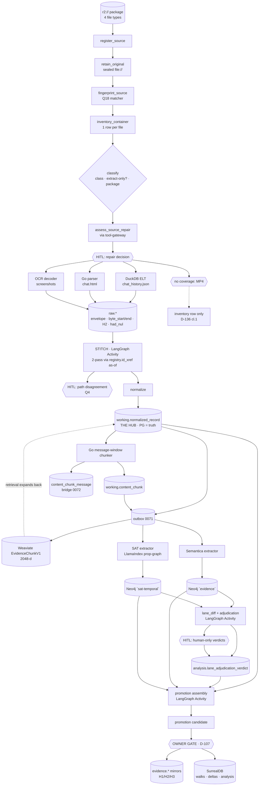

# One conversation, R2 → SurrealDB — a full thinking pass

> _Byline: Claude Code · Opus 5 · 2026-09-06._
> Subject: one messaging-export **package** (a Snapchat folder holding `chat_history.json`,
> `chat.html`, screenshot PNGs, and an MP4) travelling from `r2://` to SurrealDB.
> Binding rulings cited, never re-litigated: D-093, D-107, D-116, D-130, D-136, D-142, D-143, D-144;
> desk answers Q1=C, Q3=B, Q4-note, Q6=A, Q7=A, Q19=A, Q17 (scope), Q18.
> **STATUS: ITERATING.** Nothing here is ruled.

---

## A. Router result

Domain = **Architecture**. Types = **Understand + Decide + Evaluate**.

| Router lookup | Routed model | Role here |
|---|---|---|
| Architecture · "Scalability design" | **Systems Thinking** | meso: feedback loops, contamination, double-writes |
| Quick card · "Where's the bottleneck?" | **Theory of Constraints** | macro: what actually limits throughput today |
| Architecture · "Should we rewrite?" | **Second-Order** | dual-lane + adjudication consequences |
| Innovation/Evaluate · "Challenging assumptions" | **First Principles** | the FOR case |
| Risk · "What could go wrong?" | **Pre-mortem** | the AGAINST case |
| Quick card · "What's the probability?" | **Probabilistic/Bayesian** | the neutral estimate |
| Combination table · "System diagnosis" | **Nested** (ToC → Systems → OODA) | pattern 3 |
| Combination table · "Validating strategy" | **Adversarial** | pattern 4 |

**Deviation, declared.** The router's architecture default is *Reversibility first*; dropped deliberately
(anti-pattern "Model Without Purpose") because every Type-1 choice here is already ruled — D-093, D-107,
D-130, D-136, D-143/D-144, Q1=C. OODA is used only at the micro level, per pattern 3.

---

## B. Graph of the path

### Node / edge table

| From | To | Edge type | Strength |
|---|---|---|---|
| r2:// package | register → retain → fingerprint → inventory | dependency | 5 |
| classify | ELT ∥ Go parser ∥ OCR ∥ no-coverage | dependency, **exclusive per file** | 5 |
| every decoder | `raw.*` | dependency (one contract) | 5 |
| `raw.*` → STITCH → normalize → hub | — | dependency; stitch must precede normalize completion (Q3) | 5 |
| STITCH | HITL disagreement | conflict → gate (Q4) | 4 |
| hub | outbox (same txn, ADR-0052) · chunker → chunk + bridge (two units, D-130 r1) | dependency | 5 |
| outbox | Weaviate / Semantica / SAT | influence (fan-out) | 4 |
| lane A ↔ lane B | comparison only | **conflict, never synergy** (D-093) | 5 |
| verdict + hub + lanes | assembly → candidate → owner gate → Surreal / evidence | dependency, manual only (D-107) | 5 |
| Weaviate hit | hub (expand by conversation + ordinal) | **feedback** | 4 |
| verdict | canon via candidate/review | feedback, **oscillation hazard** | 3 |

### Centrality

| Node | Degree | Centrality | Why |
|---|---|---|---|
| `working.normalized_record` (hub) | 7 | **0.98** | every pathway starts or lands here; single writer of truth |
| `raw.*` landing contract | 5 | **0.92** | four decoders converge; H2/offsets defined here; the one contract ELT and Go must both satisfy |
| PG source coordinate (attribute on every projection) | ubiquitous | **0.90** | the only thing that makes the two lanes comparable (dual-graph §1) |
| Temporal Activity boundary | ubiquitous | 0.85 | D-130; every node above is one Activity |
| owner promotion gate | 3 | 0.70 | single point of admission to Surreal |
| `content_chunk_message` bridge | 3 | 0.62 | sole hit→message route |
| adjudication/verdict | 4 | 0.55 | new, currently absent from the plan |

**Bottleneck by topology:** `raw.*`. **Bottleneck by liveness:** the edge *into* it — `execute_parser`
has never once succeeded (see §C).

### The three pathways one message takes

1. **To search.** hub → chunker → `content_chunk` + bridge → outbox → Weaviate TextUnit (validity window
   + PG coordinate). Retrieval reverses it: hit → chunk_id → bridge → centre message → expand on the
   **hub** by conversation + ordinal. Chunk text is never rendered.
2. **To the graph lanes.** hub → outbox → *both* extractors independently → `evidence` and `sat-temporal`
   as separate node sets, each stamped with PG coordinate + `source_generation` → `lane_diff` → verdicts.
3. **To Surreal.** hub (+ chunks, + both lanes pinned at a generation, + verdicts) → assembly →
   promotion candidate → **owner decides** → sealed re-read + H1/H2/H3 → `evidence.*` mirror and the
   Surreal feed. Walks and deltas begin only here.

---

## C. Nested combination — ToC → Systems → OODA

### Macro · Theory of Constraints

| Stage | Capacity today | Utilization | Queue |
|---|---|---|---|
| register → retain → assess → HITL gate | proven live (`r2e-…`) | ~40% | 0 |
| **execute_parser → `raw.*`** | **0 records, ever** | **100%** | **everything** |
| stitch | not built | — | blocked |
| normalize → hub | code exists | 0% | starved |
| chunker → chunk + bridge | **not built** (Go) | 0% | starved |
| Weaviate embed | class live, 2048-d | 0% | 0 objects, 0 chunk rows |
| lanes / adjudication / promotion / Surreal | not built | 0% | starved |

**The constraint is the parse→raw landing edge.** Evidence, live-verified 2026-09-05: `execute_parser`
failed on `0x00` at `element:8`, surfacing to Temporal as an opaque `decode n8n StageResult: EOF`; nine
activities before it completed; `raw.*` holds zero rows; `EvidenceChunkV1` holds zero objects *because
zero chunk rows exist*; all twelve commits that day were wiring defects found **by running, not reading**.

**Exploit (no new capability):** apply Q19=A (U+FFFD + `had_nul`) · fix the n8n→worker typed
`StageResult` error contract · add `byte_start`/`byte_end` per Q1=C · assert `record_count > 0` per file ·
**run on a real package, not the synthetic fixture**.

**Subordinate:** no Stage-4 retrieval, no chunk-window tuning (Q6=A permits a provisional one), no
adjudication UI, no Surreal work beyond shape (Q17). Keeping lanes "busy" past the constraint is WIP that
hurts throughput. **Elevate only after:** register `execute_structured_elt_activity`, then the DuckDB
template registry, then the Go chunker.

### Meso · Systems Thinking

**Reinforcing loops (dangerous):**
- **R1 — the fixture loop.** Synthetic fixture → defect → fix → re-run on the *same* fixture. A whole
  defect class (real HTML, emoji, attachment refs, MP4) never surfaces. 12 commits, zero real records.
- **R2 — doc drift.** Ruling lands in the desk block → Stage 0 still shows ☐ → next session re-asks
  (exactly the pattern `2026-09-02-relitigation-pattern-and-fix.md` documents).
- **R3 — write-back oscillation.** Lane proposes → canon changes → re-projection → lane proposes again;
  every step looks legitimate. Guard designed (`source_generation`, dual-graph §3), unbuilt.
- **R4 — empty-stock protection.** Designing around data that does not exist (D-142).

**Balancing loops (keep):** HITL on path disagreement (Q4) · staleness requeue · outbox/CDC
reconciliation · golden-clone teardown instead of purge (D-142).

**Contamination / double-write points:**
1. **Two decoders, one file.** ELT primary, Go fallback-on-logged-failure — if both land, two raw
   generations and every downstream count doubles. No exclusivity mechanism is named anywhere.
2. **Chunker doing three jobs** (chunk + provenance + hash) — D-130 r1; round-1 defect #7.
3. **LlamaIndex as a second chunker** — forbidden (D-144); its nodes are built *from* the PG bridge.
4. **LangGraph writing anything but groupings/candidates** — D-144's line that does not move.
5. **Weaviate FilterExpr silently dropped** (agno 2.8.7). Dict filters only.
6. **One Neo4j instance, two databases** — a caller-selectable database lets one lane touch the other;
   D-093 requires a fixed-database gateway.
7. **A verdict written back into a lane graph** — fusion by another name.
8. **Extraction forming beliefs** — Semantica reads everything, concludes nothing; horizon discipline
   lives at the agent layer in Surreal, never here.

### Micro · OODA — the first three build iterations

| Iter | Observe | Orient | Decide | Act / exit criterion |
|---|---|---|---|---|
| **1 · Land one real record** | `execute_parser` 422 on NUL; opaque EOF to Temporal | constraint is this edge; fixture ≠ reality | apply Q19=A + typed StageResult + `byte_start/end` | One real Snapchat `chat_history.json` produces ≥1 `raw.*` row with a verifiable H2 and a byte range. Nothing else built. |
| **2 · Stitch the folder** | 4 file types, 1 conversation; MP4 has no decoder | Q3=B: the package is the unit; stitch precedes normalize completion | LangGraph stitch Activity; `registry.id_xref` as-of; any disagreement → HITL | JSON + HTML + OCR rows resolve to one conversation group; MP4 gets an inventory row and a no-coverage flag; one deliberate disagreement fires the gate. |
| **3 · Chunk + one Weaviate object** | 0 chunk rows, 0 vectors | Q6=A permits a provisional window; Q7=A splits units | Go chunker Activity (chunk+provenance) + separate hash family | One chunk, its bridge rows, one 2048-d Weaviate object carrying the PG coordinate; hit → bridge → hub expansion returns messages, not chunk text. |

---

## D. Adversarial combination

| Aspect | First Principles **FOR** | Pre-mortem **AGAINST** | Bayesian |
|---|---|---|---|
| One raw contract for ELT + parsers | A record is bytes + offset + hash; method of arrival is irrelevant. | ELT decodes before PG sees rows, so offsets are synthesized — re-verification degrades to the slow lane for everything. | P(offsets usable on ≥90% of ELT rows) **0.6** |
| Package as the ELT unit (Q3=B) | A conversation is the atom a human recognises; files are an exporter artifact. | Multi-GB XML forces whole-package `read_text`; memory blows before row 1. | P(holds without streaming rework) **0.55** |
| Stitch before normalize | Cross-file identity is knowable only while all paths' outputs coexist. | As-of `id_xref` is itself a model; a wrong stitch fuses two people's conversations and everything downstream inherits it. | P(wrong stitch reaches promotion) **0.2** |
| Two lanes, never fused | Two readings you can diff beat one averaged graph; the disagreement *is* the finding. | Nobody builds the diff; lane B becomes pure cost. | P(diff unbuilt 3 months on) **0.5** |
| Verdicts, not merges | A verdict is provenance-bearing and reversible; a merge destroys its input. | Volume exceeds human capacity → "bulk approve" → theater. | P(bulk-approve within 2 corpora) **0.45** |
| Manual promotion (D-107) | Admission to analysis is a custodial act; only the affiant makes it. | Manual becomes the constraint; "obvious" promotions get automated and D-107 erodes by exception. | P(automation pressure ≤6 months) **0.65** |
| One unit = one Activity (D-130) | Only retryable, caller-blind units survive all three call shapes. | Activity sprawl; complexity relocates into a stage graph nobody reads. | P(stage graph becomes opaque) **0.35** |

### Top 7 failure modes (pre-mortem), owner unit, probability

| # | Failure | Responsible unit | P | One-line basis |
|---|---|---|---|---|
| 1 | Ingest still never reaches `raw.*` on real data because every fix is validated on the synthetic fixture | `execute_parser_activity` + parser-activity-runtime | **60%** | Loop R1 is live and has already run 12 iterations |
| 2 | ELT and Go decoder both land raw for one file; counts double, dedup masks it | classify router / `duckdb_elt_activity` | **35%** | "Primary + fallback" is stated but no exclusivity mechanism is named |
| 3 | The MP4 (and anything else uncovered) silently vanishes — no row, no flag | `inventory_container` / classify | **45%** | Router column is a binary `extract-only?`; D-136 cl.1 violated by omission |
| 4 | Chunker ships doing chunk + provenance + hash in one unit | Go chunking Activity | **30%** | Round-1 defect #7 flagged it; the plan still carries one bullet |
| 5 | Lane diff never built; `sat-temporal` and `evidence` diverge unexamined | adjudication Activity (does not exist) | **50%** | Zero lines in any Stage; D-093 says "comparison join only" and stops |
| 6 | A verdict or alias gets written into a lane graph, quietly becoming fusion | adjudication Activity / graph gateway | **25%** | No anti-pattern currently forbids it in writing |
| 7 | Write-back oscillation between lanes goes unnoticed | proposal/candidate tables + staleness guard | **20%** | Guard is designed (dual-graph §3), unbuilt, and each step looks legitimate |

---

## E. Second-order effects of dual-lane + adjudication

**1st order.** Two independent extractions produce comparable, provenance-anchored readings; the
disagreement becomes a first-class artifact instead of an averaged-away loss.

**2nd order.** Verdict rows become a **new corpus of human judgment** — arguably the most probative
material the platform holds, born outside custody. Adjudication becomes a **queue**, and therefore a
candidate constraint at scale. Every extractor bump invalidates a slice of prior verdicts, since a verdict
is meaningful only against a `source_generation`. Two lanes double projection cost and double the surface
a horizon could later leak through.

**3rd order.** Because judgment is discoverable, the **verdict table needs its own custody posture** —
authorship, timestamp, immutable reasoning — or it is the weakest link in an otherwise sealed chain.
Verdict backlog and the promotion gate compound: manual promotion now waits on manual adjudication, so
automation pressure lands on both gates at once and the cheaper-looking one (adjudication) goes first —
**which silently authorizes fusion**. And re-verdicting after every extractor bump creates a
**re-adjudication treadmill** whose natural relief valve is pinning extractor versions forever — at which
point D-093's side-by-side evaluation inverts into two frozen legacy extractors.

---

## F. Conflict resolution — one page

**Definition.** A **conflict** exists when both lanes, reading the **same PG source coordinate** at the
**same `source_generation`**, assert mutually incompatible facts. Different generations are **staleness,
not conflict** — requeue, never adjudicate (dual-graph §2).

| Level | Conflict | Not a conflict |
|---|---|---|
| **Entity** | Contradictory *attribute* on the same coordinate (sender vs recipient role; person vs org). | Different node names/ids — identity is an **output** of the diff (dual-graph §1) → *alias candidate*, not a verdict. |
| **Edge** | Same coordinate, same (or aliased) endpoints, contradictory label or direction; or an omission inside material the other lane fully covered. | Absence where a lane has no such concept (Semantica has no `Action`) → `not_comparable`. |
| **Claim** | Two claims that cannot both be true of one coordinate (one timestamp, one sender, deleted vs not). | Two *different* claims — claims accumulate and are never rewritten (D-054). |
| **Temporal order** | Contradictory ordering or validity windows. **Highest severity** — order is what an ignorant-agent walk experiences. | PREV/NEXT structural sequence vs an asserted claim edge (ADR-0062): different kinds. |

**Detection.** A Temporal Activity `lane_diff`, fired when *both* lanes report a completed projection
generation for the same eligibility manifest. Joins on `(pg_source_coordinate, source_generation)`, reads
both graphs read-only through the fixed-database gateway, emits diff rows. Never blocks or edits a lane.

**Auto-resolvable (rules, not judgment):** generation mismatch → stale, requeue, no verdict · PG
structural sequence always beats any extracted ordering · coverage gaps → `not_comparable` ·
normalization-only differences → alias candidate with confidence, still reversible.

**Human-only (HITL, LangGraph-shaped, Q4):** contradictory sender / timestamp / deletion status · edge
direction or label contradiction at the same generation · mutually exclusive claims · **any disagreement
between two extraction paths over the same source file (Q4: immediate HITL, not a recorded finding)** ·
anything that would alter a promotion candidate.

**Verdict row shape** (`analysis.lane_adjudication_verdict`, append-only, proposed):

`verdict_id` · `pg_source_coordinate` (normalized_record_id, content_chunk_id) · `source_generation` ·
`conflict_level` (entity|edge|claim|temporal_order) · `lane_a_name` · `lane_a_receipt_id` ·
`lane_a_assertion` (jsonb) · `lane_b_name` · `lane_b_receipt_id` · `lane_b_assertion` (jsonb) ·
`detection_rule_id` · `resolution_class` (auto_rule|human) · `verdict`
(lane_a|lane_b|both_retained|neither|not_comparable|stale) · `rationale` · `decided_by` · `decided_at` ·
`supersedes_verdict_id` · `extractor_versions` (jsonb) · `run_id`.

**How Surreal consumes verdicts.** Only through the owner-gated promotion assembly (D-107). The assembly
pins the PG generation and both graph snapshots, and feeds Surreal **three separately-labelled things**:
lane A's assertion, lane B's assertion, and the verdict as its own provenance-bearing node. Surreal never
receives a merged fact. Unresolved human-only conflicts on a coordinate mark the promotion candidate
`disputed` — whether that blocks promotion or promotes-with-flag is an open owner question (§H).

**Not allowed, in writing:** no fusion of any kind — no averaging, no RRF, no confidence-weighted merge,
no "winner overwrites loser", no deleting the losing lane's rows, and **no writing a verdict or alias back
into either Neo4j database**. Both lanes' outputs remain intact and independently rebuildable from PG.

---

## G. Corrections to the current plan

1. **Stage 0 is stale against its own file.** The 2026-09-06 desk block rules Q1=C, Q3=B, Q6=A, Q7=A,
   Q19=A, but Stage 0 still carries `☐ Q19 NUL bytes`, `☐ Q2 router tie-break · Q3 ELT unit (file vs
   package)`, `☐ Q6 chunk bake-off … Q7 chunker unit split`. Mark ☑ with the desk date.
2. **Stage 0 `☐ Which January-era items … (fingerprint matcher, tz field, decoder)`** — Q18 re-adopted the
   fingerprint matcher and SMS/MMS decoder. Strike the question; move both to Stage 3.
3. **Stage 3 ordering is wrong.** `group_conversations pass 2 via registry.id_xref` sits *after*
   `Message-window chunker activity`. Q3's note requires stitching to complete **before normalization
   completes** — move it above normalize and above the chunker.
4. **Stage 3 `Message-window chunker activity … + provenance rows`** is one bullet for two units. Per
   Q7=A and round-1 defect #7: (a) chunk + provenance; (b) hashing as a separate Activity family (D-130 r2).
5. **No adjudication exists anywhere.** Stage 4's `D-093 no-fusion … comparison join only` is the sole
   mention, and it sits in the *retrieval* stage. Add a Stage-3.5 `lane_diff` + adjudication Activity and
   `analysis.lane_adjudication_verdict` to Stage 1 schema work.
6. **Stage 4 header mis-scopes D-144.** `Stage 4 — Retrieval layer (LlamaIndex + LangGraph …)`: D-144 puts
   LangGraph in ingest (stitching, verification loops, promotion assembly) and LlamaIndex in SAT-lane
   extraction. Both belong in Stage 3.
7. **Q1=C implies an unlisted migration.** Stage 1's `Register execute_structured_elt_activity … emit the
   standard RawRecordEnvelope per Q1` needs a companion migration adding nullable `byte_start`/`byte_end`
   to the raw content tables. No SQL line exists.
8. **No plan line for the typed error contract.** Live-chain open ruling #2 (`decode n8n StageResult: EOF`)
   is a constraint-exploit item; add it to Stage 1.
9. **The router has no third state.** `Router column: extract-only? decided at classify, per file` is
   binary; an uncovered MP4 needs `no-coverage → inventory row + deferred flag`, else D-136 clause 1 is
   violated by silence.
10. **Anti-patterns list is missing two lines.** Add: *never write a verdict or alias into either lane
    graph*; *never let ELT and a decoder both land raw for the same file*.

---

## H. Open owner questions

1. When a coordinate carries an **unresolved human-only conflict**, does the promotion candidate **block**,
   or promote with a `disputed` flag that Surreal can see?
2. Is the **verdict table itself custody material** — sealed, hashed, chain-linked — or ordinary
   `analysis.*` working data?
3. Does an **auto-resolved** conflict (alias, coverage gap, staleness) still produce a verdict row, or only
   a diff row?
4. When an extractor version bumps, are prior verdicts **invalidated, carried forward, or re-queued** —
   and who decides per corpus?
5. For messaging specifically: **what is an `Action`?** (deletion, edit, retraction, unsend, save?) Round-2
   asked this; it is still unanswered and the SAT lane cannot be built without it.
6. Do **immutable messages have Versions** at all, and if not, what supplies the validity window every
   Weaviate object is supposed to carry?
7. **D-107 vs the guide's live Surreal aggregation surface** — round 2 flagged the conflict; the plan still
   cites both. Which wins?
8. For an uncovered file (the MP4): **inventory row + deferred**, or does the package fail the ingest until
   a decoder exists?
9. Is the **first real ingest** the Snapchat-shaped package (4 file types, small) or Google Voice (~29k
   files, one type)? The package exercises stitching; Google Voice exercises scale. Which risk first?
10. Who is the **adjudicator** — owner only, or may a named reviewer role decide non-content conflicts?
