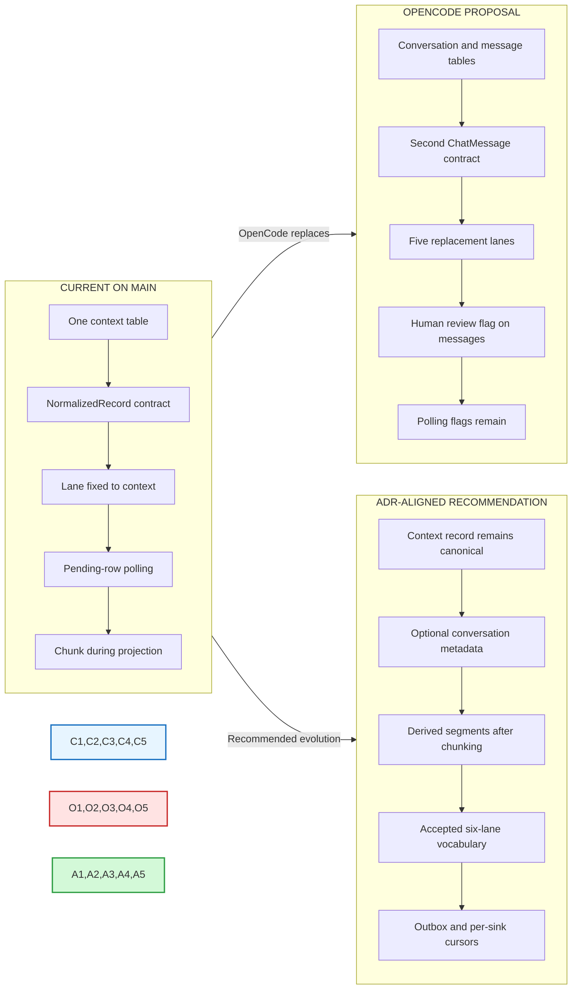
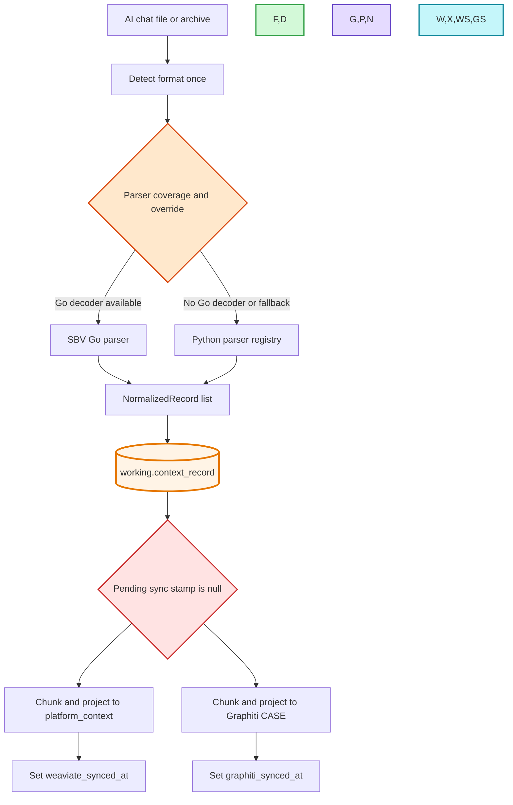
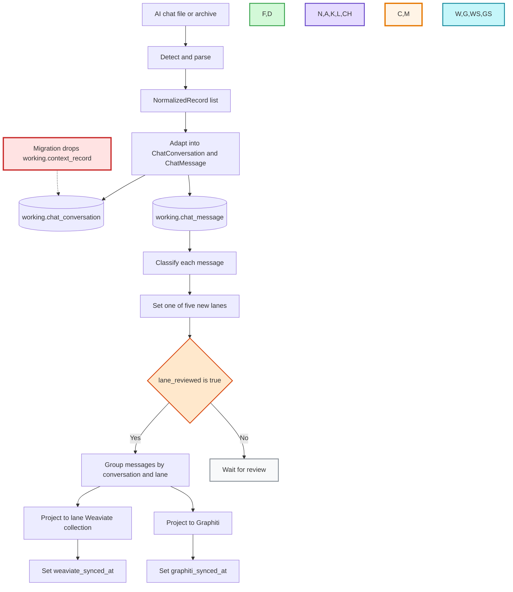
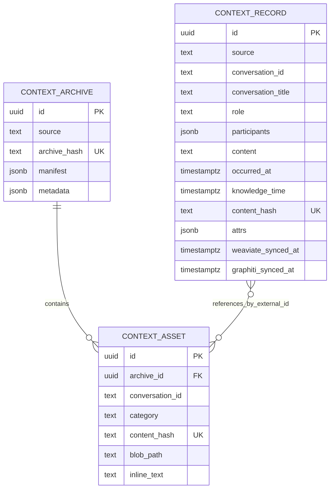
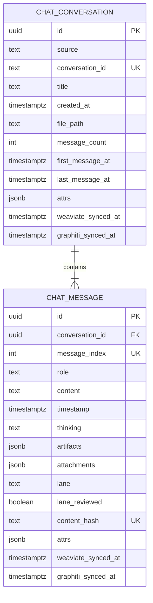
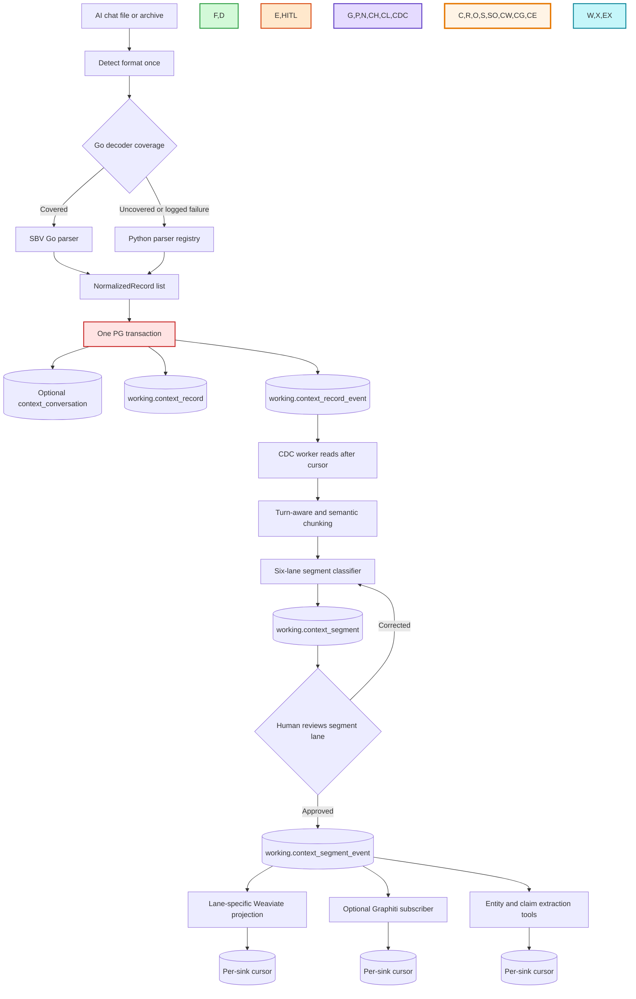
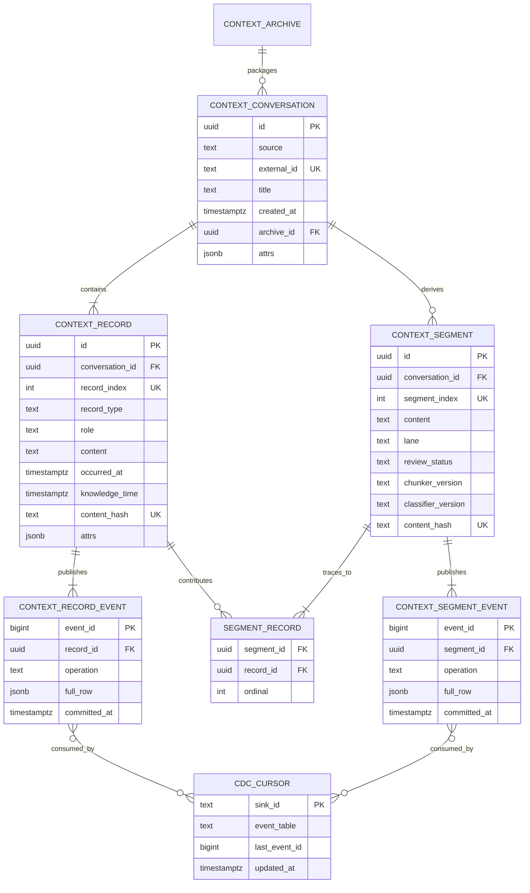
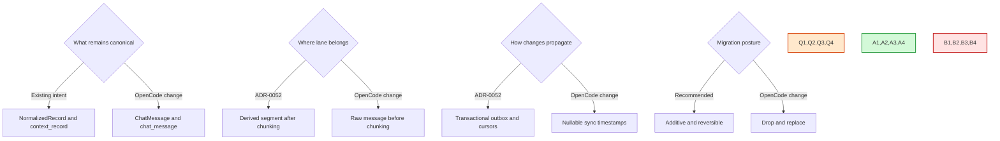

# AI-chat ingestion: current vs OpenCode vs ADR-aligned design

> _Byline: Codex · GPT-5 · 2026-08-13_

This is a visual decision aid, not an accepted architecture record. It compares:

1. **Current/live design** — migrations 0021-0023 and the code on `main` before the
   uncommitted OpenCode rewrite.
2. **OpenCode proposal** — the uncommitted migration 0024 and related Python changes.
3. **ADR-aligned recommendation** — a proposed refinement that preserves ADR-0050,
   ADR-0051, ADR-0052, D-048, and D-054. This third state is not implemented yet.

## One-screen comparison

Blue is current, red is the uncommitted OpenCode replacement, and green is the
recommended destination.

## Workflow before: current implementation

Current strengths:

- PG is written before Weaviate or Graphiti.
- Both parsers produce the same `NormalizedRecord` contract.
- Vector and graph data are rebuildable projections.
- Archive metadata/assets already have separate context tables.

Current gaps:

- `context_record.lane` is fixed to `context`, so downstream chunks cannot express
  multiple knowledge lanes.
- Sync stamps are a Phase-0 polling mechanism, not ADR-0052's durable outbox/cursor spine.
- There is no explicit persisted segment/chunk review unit.
- Message ordering is implicit rather than a first-class column.

## Workflow after: OpenCode proposal as written

What improves:

- Conversation metadata and message order become explicit.
- Thinking, created works, and attachments get dedicated columns.
- A human-review flag exists before projection.
- Different messages from one conversation can route differently.

What regresses or conflicts:

- Classification happens per message before downstream chunking. ADR-0052 says the
  chunk output is what the lane classifier routes.
- Five new lanes replace ADR-0050's accepted six lanes.
- `ChatMessage` becomes a second canonical contract beside `NormalizedRecord`.
- Migration 0024 drops a live source-of-truth table and breaks current callers.
- The accepted outbox/cursor mechanism is not implemented.
- `search_weaviate.py` bypasses the horizon-gated retrieval boundary.

## Schema before: current tables and relationships

The dotted conceptual weakness is represented by `references_by_external_id`: assets can
carry a conversation ID, but there is no relational conversation parent and no foreign key
from a record to an archive or asset.

## Schema after: OpenCode tables as written

This is a cleaner chat-shaped relational model in isolation, but it removes the shared
record contract and still mixes source rows, classification state, human review state,
and projection delivery state in `chat_message`.

## Recommended workflow: preserve raw truth, derive reviewed segments

The important boundary is that raw parsed records remain immutable source truth. Chunking,
lane assignment, review, extraction, and delivery are downstream derived state.

## Recommended schema: responsibility separated by table

`CONTEXT_ARCHIVE` already exists; it is shown to make the intended lineage visible.
The exact names and columns in the green design remain subject to the owner decision and a
new append-only migration. No existing table is dropped by this recommendation.

## Table responsibility comparison

| Concern | Current | OpenCode proposal | ADR-aligned recommendation |
|---|---|---|---|
| Raw parsed truth | `context_record` | `chat_message` | `context_record` |
| Canonical code contract | `NormalizedRecord` | `NormalizedRecord` then `ChatMessage` | `NormalizedRecord` only |
| Conversation metadata | Repeated on records/attrs | `chat_conversation` | Optional `context_conversation` parent |
| Ordering | Timestamp/implicit order | `message_index` | `record_index` |
| Lane grain | Fixed table lane | One lane per message | One lane per derived segment |
| Lane vocabulary | `context` only here | Five replacement lanes | ADR-0050 six lanes |
| Human review | None for lane | Boolean on message | Review status on derived segment |
| Chunk provenance | Recomputed, not persisted | Message IDs inside projection chunk | Segment-to-record join table |
| Change delivery | Per-row sync timestamps | Per-row sync timestamps | Full-row outbox + per-sink cursor |
| Rebuild | Clear timestamps | Clear timestamps | Reset one sink cursor |
| Horizon safety | Retrieval seam required | Direct search script bypasses seam | Every subscriber tested; retrieval seam mandatory |
| Migration safety | Live current state | Drops source table | Additive migration; no drop |

## Decision points made visible

The recommended answers are the green path. Choosing a red path is possible, but each one
would require explicitly superseding an accepted owner ruling rather than silently changing
the implementation underneath it.
